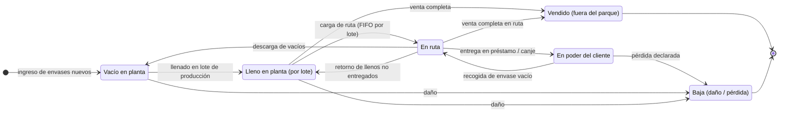
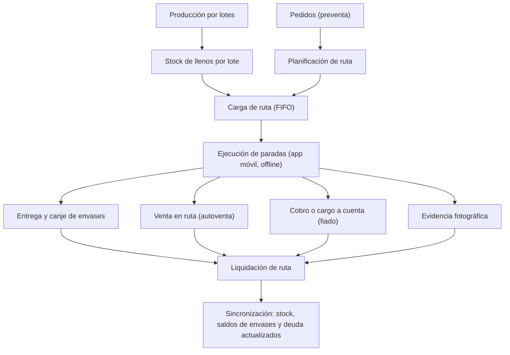
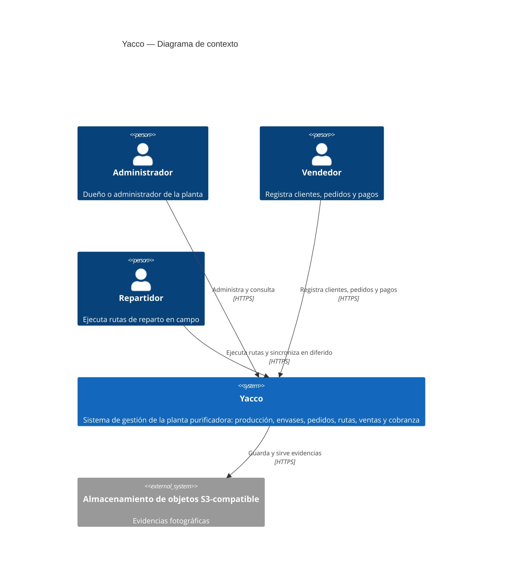
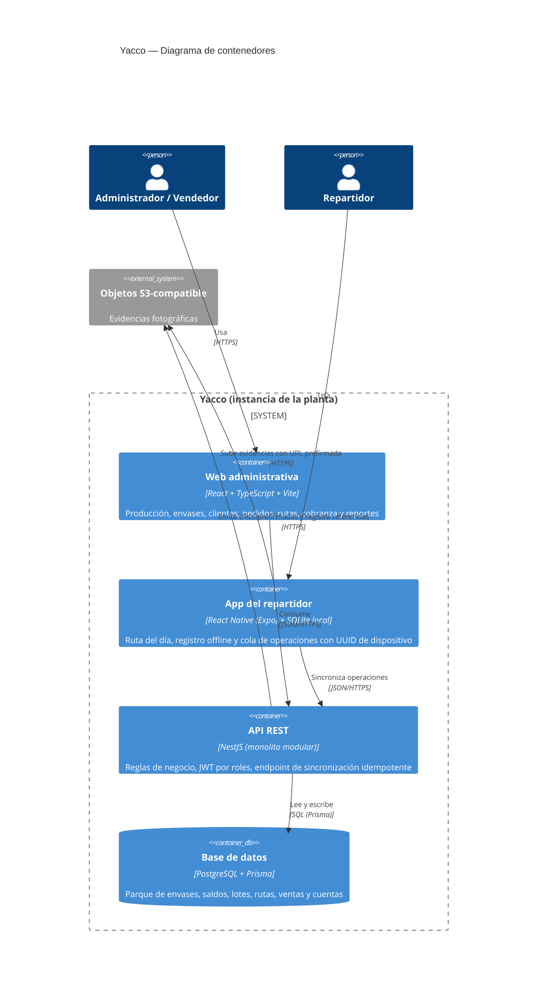
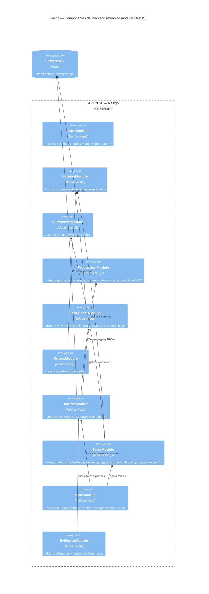
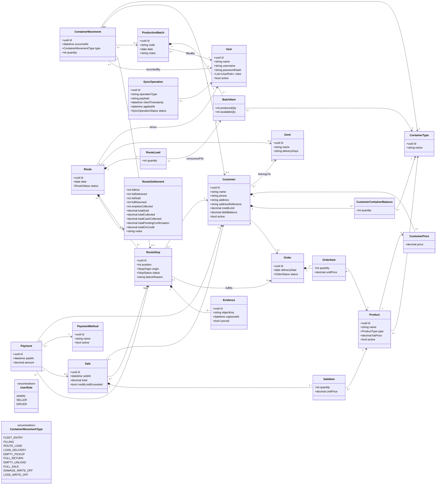
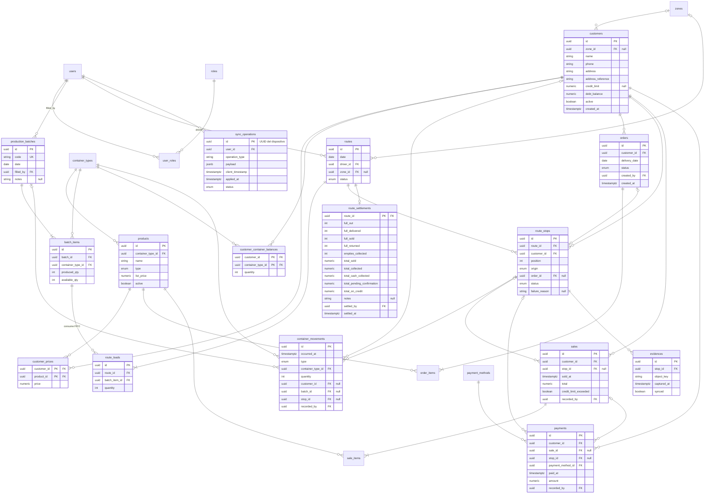

# Yacco

## Sistema de gestión para plantas purificadoras de agua

### Documentación técnica del proyecto

**Autor:** Giancarlo Sinuiri — desarrollador único
**Versión:** 1.0 (línea base — fase de idea)
**Fecha:** Agosto de 2026

---

## Índice

- **Capítulo I: Introducción y Contexto** — perfil del proyecto y del desarrollador; problemática y antecedentes; objetivos y alcance; usuarios objetivo.
- **Capítulo II: Requisitos** — análisis del dominio; necesidades de los stakeholders; lenguaje ubicuo; historias de usuario y backlog.
- **Capítulo III: Diseño del Producto** — guía de estilos; wireframes (diferidos); arquitectura C4; diseño orientado a objetos; diseño de base de datos.
- **Capítulo IV: Implementación (plan)** — gestión de configuración; plan de iteraciones; documentación de la API.
- **Capítulo V: Verificación y Validación (plan)** — pruebas automatizadas; análisis estático; validación con usuarios reales.
- **Capítulo VI: Prácticas DevOps (plan)** — integración, entrega y despliegue continuos; monitoreo y alertas.
- **Capítulo VII: Conclusiones** — lecciones aprendidas; trabajo futuro y roadmap.

---

# Capítulo I: Introducción y Contexto

## 1.1 Perfil del proyecto y del desarrollador

### Ficha del proyecto

| Campo                        | Detalle                                                                                                                                                                                                  |
| ---------------------------- | -------------------------------------------------------------------------------------------------------------------------------------------------------------------------------------------------------- |
| **Nombre**                   | Yacco                                                                                                                                                                                                    |
| **Tipo**                     | Producto de software independiente (freelance), concebido para venderse e implantarse en múltiples plantas purificadoras de agua. No responde al encargo de un cliente único.                            |
| **Dominio**                  | Gestión y automatización de la operación de plantas purificadoras de agua: producción por lotes, envases retornables, clientes, pedidos, rutas de reparto, ventas y cobranza.                            |
| **Estado actual**            | Fase de idea. No existe código, repositorio ni despliegue.                                                                                                                                               |
| **Modelo de desarrollo**     | Desarrollador único, responsable de análisis, diseño, implementación, pruebas, despliegue y documentación.                                                                                               |
| **Clientes del sistema**     | Aplicación web administrativa (React + TypeScript + Vite) y aplicación móvil para repartidores (React Native con Expo, offline-first con sincronización diferida).                                       |
| **Backend**                  | Monolito modular en NestJS (TypeScript) con PostgreSQL y Prisma, expuesto como API REST.                                                                                                                 |
| **Infraestructura prevista** | Contenedores Docker; despliegue en PaaS (Railway/Render) o VPS; almacenamiento de objetos S3-compatible para evidencias fotográficas; autenticación JWT con roles (administrador, vendedor, repartidor). |

El stack y la arquitectura anteriores constituyen una propuesta inicial, no una restricción cerrada. Su justificación técnica y eventuales ajustes se desarrollan en el Capítulo III.

### Perfil del desarrollador

El proyecto es desarrollado por una sola persona, que asume de forma integral los roles de analista, diseñador, programador, tester y operador. Esta condición no es anecdótica sino un dato de diseño: descarta de entrada prácticas que presuponen equipo (revisiones cruzadas obligatorias, ceremonias grupales) y favorece decisiones que minimicen la carga operativa sostenida, como la arquitectura de monolito modular frente a microservicios.

El desarrollador es **Giancarlo Sinuiri**, ingeniero de software, con dedicación diaria al proyecto.

## 1.2 Problemática y antecedentes

### Situación actual del negocio

Las plantas purificadoras a las que se dirige el producto operan hoy con registros manuales dispersos: cuadernos para anotar entregas y deudas, hojas de cálculo para inventarios parciales, y WhatsApp o llamadas para recibir pedidos. No existe una fuente única de información: el estado real del negocio se reconstruye cruzando anotaciones de distintas personas, y buena parte del conocimiento operativo —qué cliente tiene cuántos envases, quién debe cuánto, qué ruta conviene— vive en la memoria del dueño o de los repartidores.

### Problema central: el envase retornable como activo circulante

Lo que el cliente consume es el agua; el bidón de 20 litros que la contiene, salvo excepciones, no se vende con ella. Es un activo de la planta que sale lleno, permanece en poder del cliente, regresa vacío y vuelve a circular. La operación típica de entrega es un intercambio —se dejan bidones llenos y se recogen vacíos— y el cliente mantiene en todo momento un saldo de envases frente a la planta, en ocasiones respaldado por una garantía o depósito.

Sin un registro sistemático de esa circulación:

- No se sabe cuántos envases existen en total ni dónde están: llenos en planta, vacíos en planta, en poder de qué cliente o en ruta.
- Las pérdidas y los daños se detectan tarde o no se detectan. El parque de envases se erosiona de forma silenciosa, y reponer un envase perdido consume el margen de muchas recargas.
- Las garantías o depósitos, cuando existen, no se concilian contra los envases realmente prestados, lo que produce disputas al cierre de la relación con un cliente.

Este es el defecto estructural de gestionar el negocio con herramientas genéricas: una hoja de cálculo o un punto de venta modelan artículos que se venden y salen del sistema, no activos que circulan, retornan, se dañan o se pierden.

### Problemas asociados

- **Cobranza y crédito informal.** Parte de las ventas se realiza al crédito ("fiado") y se registra en cuadernos. Los saldos se olvidan, se discuten o se pierden con el cuaderno; no hay estados de cuenta ni una visión consolidada de la deuda por cliente.
- **Reparto ineficiente.** Las rutas se arman de memoria o sobre la marcha, sin orden por zonas ni registro estructurado por parada. El resultado son recorridos redundantes, entregas fallidas y nula trazabilidad de qué se entregó, se recogió o se cobró en cada visita.
- **Producción sin registro.** Los lotes de producción no se documentan de forma estructurada, lo que impide conocer rendimientos y mermas o relacionar lo producido con lo distribuido.

### Antecedentes

El proyecto nace de la operación de una planta purificadora real en el Perú, que actúa como cliente de referencia: sus procesos alimentan el levantamiento de requisitos (Capítulo II) y su personal participará en la validación con usuarios reales (5.3).

> ⚠️ PENDIENTE: si se desea documentarlo, evaluación de soluciones existentes en el mercado y razones por las que se descartan.

## 1.3 Objetivos y alcance

### Objetivo general

Desarrollar Yacco, un sistema de gestión para plantas purificadoras de agua que registre y dé trazabilidad al ciclo completo del negocio —producción, circulación de envases retornables, pedidos, reparto, ventas y cobranza—, sustituyendo los registros manuales dispersos por una fuente única de información operativa.

### Objetivos específicos

1. Registrar la producción por lotes.
2. Controlar el parque de envases retornables: existencias en planta (llenos y vacíos), saldo de envases en poder de cada cliente, bajas por daño o pérdida y, cuando aplique, garantías o depósitos asociados.
3. Gestionar clientes y pedidos: captura, seguimiento de estado e historial.
4. Planificar rutas de reparto y ejecutarlas desde una aplicación móvil con funcionamiento sin conexión y sincronización diferida, registrando en cada parada entregas, recogida de envases, cobros y evidencia fotográfica.
5. Registrar ventas y cobranza: ventas al contado y al crédito, pagos, estados de cuenta y deuda por cliente.
6. Consolidar la información operativa para la administración: envases en circulación, deuda total, cumplimiento de rutas y producción.

### Alcance propuesto para la primera versión

**Incluye:**

- Backend monolítico modular (producción, inventario de envases, clientes, pedidos, rutas, ventas/cobranza) expuesto como API REST.
- Aplicación web administrativa para administradores y vendedores.
- Aplicación móvil offline-first para repartidores.
- Autenticación con JWT y control de acceso por roles (administrador, vendedor, repartidor).
- Almacenamiento de evidencias fotográficas en un servicio de objetos S3-compatible.

**Excluye (propuesta, sujeta a validación en el Capítulo II):**

- Facturación electrónica e integraciones con obligaciones fiscales locales.
- Pasarelas de pago en línea.
- Optimización algorítmica de rutas (VRP); la primera versión contempla ordenamiento manual o asistido simple de las paradas.
- Integración con hardware (básculas, sensores, GPS dedicado).
- Aplicación de autoservicio para el cliente final.
- Nómina, contabilidad general y otros módulos administrativos ajenos a la operación.

**Decisión de producto abierta:** el modelo de despliegue —una instancia por planta o SaaS multi-tenant— condiciona requisitos (configuración por planta, aislamiento de datos) y arquitectura. Se decidirá a más tardar en el Capítulo III.

**Mercado objetivo:** Perú. Moneda de operación: sol peruano (S/). Las obligaciones de facturación electrónica ante la SUNAT se mantienen fuera del alcance de la primera versión y se retoman como trabajo futuro (7.2).

## 1.4 Usuarios objetivo

El producto tiene un comprador claro —el dueño de la planta— y tres perfiles de uso:

| Rol                       | Descripción                                                                                                                             | Cliente que utiliza              | Necesidades clave                                                                                                                                       |
| ------------------------- | --------------------------------------------------------------------------------------------------------------------------------------- | -------------------------------- | ------------------------------------------------------------------------------------------------------------------------------------------------------- |
| **Dueño / administrador** | Responsable del negocio; en plantas pequeñas concentra administración, compras y decisiones. Usuario primario y comprador del producto. | Web administrativa               | Visibilidad de envases en circulación, deuda por cliente, producción y desempeño del reparto; configuración del sistema y de precios.                   |
| **Vendedor**              | Registra clientes y captura pedidos; da seguimiento a cuentas por cobrar.                                                               | Web administrativa               | Alta rápida de clientes y pedidos; historial y estado de cuenta a la vista.                                                                             |
| **Repartidor**            | Ejecuta la ruta: entrega bidones llenos, recoge vacíos y cobra en el punto de entrega.                                                  | Aplicación móvil (offline-first) | Ruta del día ordenada; registro de entrega, recogida y cobro por parada sin depender de la señal; captura de evidencia fotográfica con mínima fricción. |

De estos perfiles se desprenden dos consideraciones de diseño:

- Es previsible que en plantas pequeñas una misma persona ejerza varios roles (el dueño que también reparte, el repartidor que también vende). El modelo de autorización deberá permitir asignar múltiples roles a un mismo usuario.
- La adopción por parte del repartidor es la condición de éxito operativa: si registrar una parada en la app cuesta más esfuerzo que anotarla en el cuaderno, los datos no se capturarán. La app móvil debe funcionar con conectividad intermitente y priorizar la velocidad de captura sobre la exhaustividad.

---

# Capítulo II: Requisitos

## 2.1 Análisis del dominio

### Contexto

El dominio es la operación diaria de una planta purificadora de agua en el Perú; la moneda de operación es el sol peruano (S/). El análisis parte de una planta real de referencia (ver 2.2) y de las reglas de negocio ya definidas por el desarrollador. El producto central es la **recarga**: venta de agua purificada entregada en bidones retornables de 20 litros, en dos variantes de envase: **con caño** y **sin caño**.

### El envase retornable: tenencia y control

Decisiones de dominio definidas:

- **Control por cantidades, no por unidad.** Los bidones no se identifican individualmente (sin serie ni código). El sistema controla cantidades por **tipo de envase** (con caño / sin caño) y por estado.
- **Tenencia por préstamo sin depósito.** Los envases se entregan en préstamo (comodato): la planta conserva la propiedad y el cliente acumula un **saldo de envases** por tipo — la cantidad que tiene en su poder y debe devolver. No se cobra garantía.
- **Venta de envase.** El envase puede venderse: hoy, como **venta completa** en el punto de entrega (ver canje); a futuro, como línea de venta directa. Un envase vendido sale del parque y no genera saldo.

El **canje** es la operación normal de entrega: se dejan llenos y se recogen vacíos, típicamente 1:1, con lo que el saldo del cliente no varía. Cuando el cliente no tiene vacíos suficientes, la diferencia se resuelve por una de dos vías definidas por el negocio:

1. **Deuda de envases:** la diferencia incrementa el saldo de envases del cliente (queda debiendo bidones).
2. **Venta completa:** se cobra el envase junto con el agua; esos bidones salen del parque y no afectan el saldo.

Los estados agregados del parque y sus transiciones:



Distinción clave del dominio: por cada cliente coexisten **dos deudas independientes** — la **deuda de envases** (unidades de bidones por devolver) y la **deuda monetaria** (soles por pagar, originada en el fiado). Un cliente puede tener una, ambas o ninguna; el sistema las lleva por separado y nunca las mezcla.

### Producción por lotes y trazabilidad FIFO

La producción se registra por **lotes**: cada corrida de llenado genera un lote con fecha y cantidades llenadas por tipo de envase, consumiendo envases vacíos del stock. La regla de rotación es **FIFO**: al cargar una ruta se toman los llenos del lote más antiguo con existencias, de modo que se reparte primero lo producido primero. Como el control es por cantidades, la trazabilidad resultante es a nivel de flujo: se sabe qué lotes compusieron la carga de cada ruta y, por tanto, de qué lote o lotes provino lo entregado a cada cliente.

Además de la fecha y las cantidades por tipo, cada lote registra al **responsable del llenado**. No se registran controles de calidad en la primera versión.

### Ventas, precios y crédito

- **Modalidades de venta:** contado y crédito ("fiado"). El fiado genera deuda monetaria en la cuenta del cliente.
- **Límite de crédito por cliente:** al superarse con una nueva venta, el sistema **advierte pero no bloquea**; la operación puede continuar y la advertencia queda registrada.
- **Precios:** existe un precio de lista por producto y la posibilidad de **precio personalizado por cliente**, que prevalece sobre la lista.

El catálogo se limita a la **recarga de 20 L** y la **venta de envase**, cada una en sus dos tipos de envase (con caño / sin caño); no se comercializan accesorios ni otros formatos. Los cobros **distinguen siempre el medio de pago** (efectivo, transferencia, billeteras digitales como Yape y Plin), porque la planta necesita reportes de cobranza por cada tipo.

### Reparto: preventa y autoventa

Coexisten dos modalidades de venta en campo:

- **Preventa:** el pedido se captura por adelantado (vendedor o administrador) y la ruta lo entrega.
- **Autoventa:** el repartidor vende en ruta a clientes no planificados, con el stock de su carga.

Una **ruta** agrupa, para un día y un repartidor: la **carga** (llenos asignados FIFO por lote), las **paradas** (originadas en pedidos o creadas en campo) y lo ocurrido en cada una: entrega y canje, cobro o fiado, y evidencia fotográfica. Al cierre, la **liquidación** concilia envases (llenos salidos vs. entregados, vendidos y retornados; vacíos recogidos) y dinero (cobrado vs. fiado). Las rutas pueden ser **fijas** —por zona y día de reparto, con la cartera recurrente del repartidor— o **armarse cada día a partir de los pedidos**; ambas modalidades coexisten. La app del repartidor opera sin conexión y sincroniza en diferido.



## 2.2 Necesidades del usuario / stakeholder

La fuente primaria de requisitos es la planta purificadora de referencia: la primera versión del sistema se construye para su operación, y su dueño es a la vez stakeholder principal, primer usuario y validador (5.3). Como supuesto de trabajo, la v1 se despliega como **instancia única para esa planta**; la decisión formal de despliegue (y su extensión a otras plantas) se documenta en el Capítulo III.

| Stakeholder                                      | Relación con el sistema                    | Necesidades principales                                                                                                                                                                                                                            |
| ------------------------------------------------ | ------------------------------------------ | -------------------------------------------------------------------------------------------------------------------------------------------------------------------------------------------------------------------------------------------------- |
| **Dueño / administrador** (planta de referencia) | Comprador y usuario primario (web)         | Saber cuántos envases están prestados, a quién y de qué tipo; deuda por cliente y total; trazabilidad FIFO de lotes; fijar precios personalizados y límites de crédito; conciliar cada ruta (envases y dinero); visibilidad de producción y stock. |
| **Vendedor**                                     | Usuario de la web administrativa           | Alta rápida de clientes y pedidos; consultar estado de cuenta y saldo de envases al atender; registrar pagos.                                                                                                                                      |
| **Repartidor**                                   | Usuario de la app móvil                    | Ruta del día clara aun sin señal; registrar cada parada en segundos; resolver en el punto los casos sin canje (deuda de envases o venta completa); vender en ruta; adjuntar evidencia; liquidar sin discusiones.                                   |
| **Cliente final**                                | Stakeholder indirecto; no es usuario en v1 | Entregas oportunas; cuentas claras y verificables ante cualquier disputa (estado de cuenta, evidencia de entrega).                                                                                                                                 |
| **Desarrollador**                                | Proveedor del producto                     | Costo operativo bajo y sostenible por una sola persona; diseño replicable a otras plantas a futuro.                                                                                                                                                |

> ⚠️ PENDIENTE: escala de la planta de referencia (clientes activos, pedidos por día, número de repartidores), necesaria para dimensionar requisitos no funcionales y prioridades.

De estas necesidades se derivan requisitos no funcionales que condicionan el diseño:

- **Offline-first real:** la app móvil debe operar jornadas completas sin señal; la sincronización diferida debe ser idempotente (ninguna operación se aplica dos veces).
- **Integridad de saldos:** los movimientos de envases y de dinero deben cuadrar siempre; toda variación de saldo proviene de una operación registrada.
- **Baja fricción de captura:** registrar una parada debe costar menos esfuerzo que anotarla en un cuaderno.
- **Auditabilidad:** todo movimiento registra quién lo hizo y cuándo.
- **Hardware modesto:** teléfonos Android de gama media/baja y planes de datos limitados.

## 2.3 Lenguaje ubicuo

| Término                                 | Definición                                                                                                                                                    |
| --------------------------------------- | ------------------------------------------------------------------------------------------------------------------------------------------------------------- |
| **Planta**                              | La purificadora de agua; unidad de negocio que produce, reparte y cobra.                                                                                      |
| **Cliente**                             | Persona o negocio que recibe agua. Tiene saldo de envases, deuda monetaria, precio personalizado opcional y límite de crédito opcional.                       |
| **Bidón**                               | Envase retornable de 20 litros propiedad de la planta (salvo venta).                                                                                          |
| **Caño**                                | Válvula dispensadora incorporada al bidón. Da lugar a dos tipos de envase.                                                                                    |
| **Tipo de envase**                      | Variante del bidón controlada por separado: **con caño** o **sin caño**.                                                                                      |
| **Parque de envases**                   | Total de bidones propiedad de la planta, en cualquier estado (vacíos, llenos, en ruta, prestados).                                                            |
| **Préstamo (comodato)**                 | Modalidad de tenencia: la planta entrega el envase sin depósito y conserva la propiedad; el cliente debe devolverlo.                                          |
| **Saldo de envases (deuda de envases)** | Cantidad de bidones, por tipo, que un cliente tiene en su poder y debe devolver. Se mide en unidades, no en dinero.                                           |
| **Canje**                               | Intercambio lleno por vacío en la entrega; en el caso típico 1:1 el saldo del cliente no varía.                                                               |
| **Recarga**                             | Producto principal: venta del agua con canje del envase.                                                                                                      |
| **Venta completa**                      | Venta del bidón lleno incluyendo el envase, usada cuando no hay vacío que canjear (o como venta directa futura). El envase sale del parque y no genera saldo. |
| **Baja**                                | Salida definitiva de un envase del parque por daño o pérdida.                                                                                                 |
| **Lote (de producción)**                | Corrida de llenado con fecha y cantidades por tipo de envase; consume vacíos y crea llenos. Base de la trazabilidad.                                          |
| **FIFO**                                | Regla de rotación: lo primero producido es lo primero repartido; la carga de ruta consume siempre del lote más antiguo con existencias.                       |
| **Pedido**                              | Solicitud de un cliente (preventa) con productos, cantidades y fecha de entrega.                                                                              |
| **Preventa**                            | Modalidad en la que el pedido se captura antes y la ruta lo entrega.                                                                                          |
| **Autoventa**                           | Venta creada por el repartidor en campo, a clientes no planificados, contra el stock de su carga.                                                             |
| **Ruta**                                | Plan de reparto de un día asignado a un repartidor: carga + paradas + resultados.                                                                             |
| **Carga (de ruta)**                     | Bidones llenos asignados a la ruta, tomados FIFO por lote.                                                                                                    |
| **Parada**                              | Visita a un cliente dentro de una ruta; se origina en un pedido o se crea en campo.                                                                           |
| **Entrega**                             | Registro de lo ocurrido en la parada: llenos dejados, vacíos recogidos, resolución del canje, cobro y evidencia.                                              |
| **Evidencia**                           | Fotografía capturada en la parada como respaldo de la entrega.                                                                                                |
| **Liquidación (de ruta)**               | Conciliación al cierre de la ruta: envases (salidos vs. entregados, vendidos y retornados; vacíos recogidos) y dinero (cobrado vs. fiado).                    |
| **Fiado (venta al crédito)**            | Venta sin pago inmediato; genera deuda monetaria.                                                                                                             |
| **Deuda monetaria (cuenta por cobrar)** | Saldo en soles que el cliente debe a la planta. Independiente de la deuda de envases.                                                                         |
| **Límite de crédito**                   | Umbral de deuda monetaria por cliente. Al superarse, el sistema advierte pero no bloquea la venta.                                                            |
| **Precio de lista**                     | Precio estándar de un producto.                                                                                                                               |
| **Precio personalizado**                | Precio acordado con un cliente específico; prevalece sobre el de lista.                                                                                       |
| **Pago (abono)**                        | Registro que reduce la deuda monetaria; puede ser parcial o total.                                                                                            |
| **Estado de cuenta**                    | Historial de cargos y pagos de un cliente, con su saldo actual.                                                                                               |
| **Medio de pago**                       | Forma en que se recibe un pago (efectivo, transferencia, Yape, Plin). Todo cobro lo registra y la cobranza se reporta por medio de pago.                      |
| **Zona**                                | Agrupación geográfica de clientes usada para las rutas fijas por día de reparto; una ruta también puede armarse solo a partir de pedidos.                     |
| **Sincronización diferida**             | La app móvil registra sin conexión y envía las operaciones al servidor cuando recupera señal, aplicándolas exactamente una vez.                               |

## 2.4 Historias de usuario y backlog

Formato: `Como <rol>, quiero <acción>, para <beneficio>`, con criterios de aceptación en Gherkin. La prioridad usa MoSCoW: **M** (Must, imprescindible para el MVP), **S** (Should, primera mejora tras el MVP), **C** (Could, posterior). El plan de iteraciones que ordena estas historias en el tiempo se propone en 4.2.

### Épica A — Producción e inventario de envases

| ID    | Historia                                                                                                                                                                               | Criterios de aceptación                                                                                                                                                                                                                                                                                                                                                        | Prioridad |
| ----- | -------------------------------------------------------------------------------------------------------------------------------------------------------------------------------------- | ------------------------------------------------------------------------------------------------------------------------------------------------------------------------------------------------------------------------------------------------------------------------------------------------------------------------------------------------------------------------------ | --------- |
| HU-01 | Como administrador, quiero registrar un lote de producción con fecha, responsable del llenado y cantidades llenadas por tipo de envase, para mantener la trazabilidad de lo producido. | **E1** Dado stock de vacíos registrado, cuando registro un lote con cantidades por tipo, entonces se crea el lote, el stock de llenos aumenta asociado a él y el de vacíos disminuye en la misma cantidad. <br> **E2** Dado que la cantidad a llenar supera los vacíos registrados, cuando intento guardar, entonces el sistema advierte la inconsistencia antes de confirmar. | M         |
| HU-02 | Como administrador, quiero ver el stock de envases por estado (vacío, lleno por lote, en ruta, prestado, baja) y por tipo, para conocer el parque completo.                            | **E1** Dado movimientos registrados, cuando consulto el inventario, entonces veo cantidades por estado y tipo, y la suma cuadra con el parque total.                                                                                                                                                                                                                           | M         |
| HU-03 | Como administrador, quiero registrar bajas de envases por daño o pérdida, para que el parque refleje la realidad.                                                                      | **E1** Dado un envase dañado en planta, cuando registro la baja con motivo, entonces el stock disminuye y la baja queda en el historial. <br> **E2** Dado un cliente con saldo de envases, cuando registro la pérdida de N envases en su poder, entonces su saldo disminuye en N y el parque registra la baja por pérdida.                                                     | M         |
| HU-04 | Como administrador, quiero registrar el ingreso de envases nuevos al parque, para reflejar las compras de bidones.                                                                     | **E1** Cuando registro el ingreso de N envases de un tipo, entonces el stock de vacíos en planta aumenta en N.                                                                                                                                                                                                                                                                 | M         |

### Épica B — Clientes, pedidos y precios

| ID    | Historia                                                                                                                                | Criterios de aceptación                                                                                                                                                                                | Prioridad |
| ----- | --------------------------------------------------------------------------------------------------------------------------------------- | ------------------------------------------------------------------------------------------------------------------------------------------------------------------------------------------------------ | --------- |
| HU-05 | Como vendedor, quiero registrar clientes con sus datos de contacto y ubicación, para organizar el reparto y las cuentas.                | **E1** Cuando registro un cliente con nombre, teléfono y dirección o referencia, entonces se crea con saldo de envases 0 y deuda S/ 0.                                                                 | M         |
| HU-06 | Como vendedor, quiero registrar pedidos (preventa) con productos, cantidades y fecha de entrega, para que se planifiquen en ruta.       | **E1** Dado un cliente registrado, cuando capturo un pedido, entonces queda en estado «pendiente», disponible para asignar a una ruta, con precios según lista o personalizado.                        | M         |
| HU-07 | Como vendedor, quiero consultar el estado de cuenta y el saldo de envases de un cliente, para responder consultas y gestionar cobranza. | **E1** Dado un cliente con movimientos, cuando abro su ficha, entonces veo su deuda monetaria, su saldo de envases por tipo y el historial de cargos, pagos y entregas.                                | M         |
| HU-08 | Como administrador, quiero asignar precios personalizados por cliente y producto, para respetar acuerdos comerciales.                   | **E1** Dado un producto con precio de lista S/ X, cuando asigno al cliente un precio personalizado S/ Y, entonces sus próximos pedidos y ventas usan S/ Y.                                             | M         |
| HU-09 | Como administrador, quiero definir un límite de crédito por cliente, para controlar el fiado sin bloquear ventas.                       | **E1** Dado un cliente con límite asignado, cuando una venta al fiado hará que su deuda lo supere, entonces el sistema muestra una advertencia, permite continuar y deja constancia de la advertencia. | M         |

### Épica C — Rutas y reparto (app móvil)

| ID    | Historia                                                                                                                                                | Criterios de aceptación                                                                                                                                                                                                                                                                                                                                                                                                                                         | Prioridad |
| ----- | ------------------------------------------------------------------------------------------------------------------------------------------------------- | --------------------------------------------------------------------------------------------------------------------------------------------------------------------------------------------------------------------------------------------------------------------------------------------------------------------------------------------------------------------------------------------------------------------------------------------------------------- | --------- |
| HU-10 | Como administrador, quiero planificar una ruta asignando repartidor, pedidos pendientes y carga, para ordenar el reparto del día.                       | **E1** Dado pedidos pendientes y stock de llenos por lote, cuando creo la ruta con sus paradas y carga, entonces la carga se descuenta comenzando por el lote más antiguo (FIFO) y los pedidos asignados pasan a «en ruta».                                                                                                                                                                                                                                     | M         |
| HU-11 | Como repartidor, quiero ver mi ruta del día en el móvil con los datos de cada parada, para ejecutarla sin llamar a la planta.                           | **E1** Dado que sincronicé al iniciar el día, cuando pierdo la conexión, entonces sigo viendo la ruta completa (dirección, saldo de envases y deuda de cada cliente) y puedo registrar sin señal.                                                                                                                                                                                                                                                               | M         |
| HU-12 | Como repartidor, quiero registrar en cada parada los llenos entregados y vacíos recogidos por tipo, para que los saldos de envases se actualicen solos. | **E1** Dado una parada con 3 llenos a entregar, cuando registro 3 entregados y 3 vacíos recogidos, entonces el saldo del cliente no varía. <br> **E2** Dado que el cliente entrega solo 1 vacío por 3 llenos, cuando elijo «deuda de envases», entonces su saldo aumenta en 2. <br> **E3** Dado la misma diferencia, cuando elijo «venta completa», entonces se cobra el envase por cada unidad no canjeada, esos envases salen del parque y el saldo no varía. | M         |
| HU-13 | Como repartidor, quiero registrar el cobro de cada parada (total, parcial o fiado), para que la deuda quede al día.                                     | **E1** Dado un total de S/ 40, cuando registro un pago de S/ 25, entonces se registra el abono y la deuda del cliente aumenta en S/ 15. <br> **E2** Dado que el cargo superará el límite de crédito, cuando confirmo el fiado, entonces veo la advertencia y puedo continuar.                                                                                                                                                                                   | M         |
| HU-14 | Como repartidor, quiero vender en ruta a clientes no planificados (autoventa), para aprovechar la demanda en campo.                                     | **E1** Dado carga disponible, cuando registro una venta a un cliente existente o creado en el momento, entonces se descuenta de mi carga y aplican las mismas reglas de canje, precio y cobro.                                                                                                                                                                                                                                                                  | M         |
| HU-15 | Como repartidor, quiero adjuntar evidencia fotográfica en la parada, para respaldar la entrega.                                                         | **E1** Dado una parada sin señal, cuando capturo la fotografía, entonces queda asociada a la parada en una cola local y se sube automáticamente al sincronizar.                                                                                                                                                                                                                                                                                                 | S         |
| HU-16 | Como repartidor, quiero que todo lo registrado sin señal se sincronice solo al recuperar conexión, para no duplicar trabajo.                            | **E1** Dado N operaciones registradas sin conexión, cuando la app recupera señal y reintenta el envío incluso más de una vez, entonces cada operación se aplica exactamente una vez en el servidor y en orden.                                                                                                                                                                                                                                                  | M         |
| HU-17 | Como administrador, quiero liquidar cada ruta al cierre, para conciliar envases y dinero.                                                               | **E1** Dado una ruta finalizada, cuando la liquido, entonces el sistema concilia: llenos salidos = entregados + vendidos completos + retornados; vacíos recogidos = descargados; total vendido = cobrado + fiado; y toda diferencia queda registrada.                                                                                                                                                                                                           | M         |

### Épica D — Cobranza y reportes

| ID    | Historia                                                                                                                                | Criterios de aceptación                                                                                                                                                                  | Prioridad |
| ----- | --------------------------------------------------------------------------------------------------------------------------------------- | ---------------------------------------------------------------------------------------------------------------------------------------------------------------------------------------- | --------- |
| HU-18 | Como vendedor, quiero registrar pagos de clientes fuera de la ruta (en planta o posteriores), para mantener el estado de cuenta al día. | **E1** Dado un cliente con deuda, cuando registro un abono en la web, entonces su deuda disminuye y el abono aparece en el estado de cuenta.                                             | M         |
| HU-19 | Como administrador, quiero un reporte de deuda monetaria por cliente, para priorizar la cobranza.                                       | **E1** Dado clientes con fiado, cuando abro el reporte, entonces veo la deuda por cliente, el total general y la fecha del cargo más antiguo de cada uno.                                | S         |
| HU-20 | Como administrador, quiero un reporte de envases prestados por cliente y tipo, para gestionar la recuperación de bidones.               | **E1** Dado envases prestados, cuando abro el reporte, entonces veo el saldo por cliente y tipo y el total prestado, y ese total cuadra con el estado «en poder del cliente» del parque. | M         |
| HU-21 | Como administrador, quiero consultar la producción por periodo, para conocer volúmenes y rotación de lotes.                             | **E1** Dado lotes registrados, cuando consulto un rango de fechas, entonces veo cantidades producidas por tipo y por lote.                                                               | C         |

### Épica E — Seguridad y administración

| ID    | Historia                                                                                                                                                               | Criterios de aceptación                                                                                                                                                            | Prioridad |
| ----- | ---------------------------------------------------------------------------------------------------------------------------------------------------------------------- | ---------------------------------------------------------------------------------------------------------------------------------------------------------------------------------- | --------- |
| HU-22 | Como administrador, quiero gestionar usuarios con uno o más roles (administrador, vendedor, repartidor), para reflejar que una persona puede cumplir varias funciones. | **E1** Dado el rol administrador, cuando creo un usuario con los roles vendedor y repartidor, entonces ese usuario accede a las funciones de ambos.                                | M         |
| HU-23 | Como usuario, quiero iniciar sesión con mis credenciales y que mis permisos dependan de mis roles, para proteger la información de la planta.                          | **E1** Dado un usuario activo, cuando inicia sesión con credenciales válidas, entonces accede solo a las funciones de sus roles; con credenciales inválidas, el acceso se rechaza. | M         |

### Priorización

El MVP lo componen las historias **M**: cubren el ciclo operativo completo (producir → cargar ruta FIFO → entregar con canje y sus dos resoluciones → cobrar o fiar → liquidar → sincronizar) más el control de parque y saldos, que es el problema central del negocio. Las **S** (evidencia fotográfica y reporte de deuda) entran inmediatamente después; las **C** son mejoras posteriores. Esta priorización es una propuesta del desarrollador y se contrastará con el dueño de la planta de referencia; el ordenamiento temporal por iteraciones se detalla en 4.2.

---

# Capítulo III: Diseño del Producto

> Convención del proyecto: todos los identificadores de código (clases, atributos, variables, tablas, columnas, enumeraciones y endpoints) se nombran en **inglés**, respetando las convenciones de cada capa; el español se reserva para la interfaz de usuario y esta documentación.

## 3.1 Guía de estilos

Yacco no cuenta con identidad visual previa. Lo siguiente es una **propuesta inicial del desarrollador**: suficiente para construir interfaces consistentes desde el primer sprint, y revisable cuando exista una identidad de marca.

**Principios.** Interfaz utilitaria antes que decorativa. La web administrativa privilegia densidad de información (tablas, saldos, reportes). La app móvil privilegia velocidad de captura con una mano, objetivos táctiles grandes y alto contraste, porque se usa en exteriores y bajo luz solar.

**Paleta**

| Uso                                                       | Color               | Hex                   |
| --------------------------------------------------------- | ------------------- | --------------------- |
| Primario (marca, acciones principales)                    | Azul agua           | `#0E7490`             |
| Primario oscuro (encabezados, énfasis)                    | Azul profundo       | `#155E75`             |
| Éxito (entregas completas, pagos)                         | Verde               | `#16A34A`             |
| Advertencia (límite de crédito, inconsistencias de stock) | Ámbar               | `#D97706`             |
| Error (fallos, bajas)                                     | Rojo                | `#DC2626`             |
| Texto principal                                           | Gris pizarra        | `#0F172A`             |
| Texto secundario                                          | Gris medio          | `#475569`             |
| Fondos y superficies                                      | Blanco / gris claro | `#FFFFFF` / `#F1F5F9` |

Regla semántica: las dos deudas del cliente (monetaria y de envases) se muestran en ámbar, y en rojo solo si superan el límite. La advertencia de límite de crédito nunca se presenta como error: advierte, no bloquea, en coherencia con la regla de negocio.

**Tipografía.** Inter, con la fuente del sistema como respaldo. Cuerpo 16 px; en móvil, campos y botones a 18 px. Montos y cantidades con números tabulares (`font-variant-numeric: tabular-nums`) para que las columnas de saldos cuadren visualmente.

**Formatos regionales.** Moneda: `S/ 1,250.50`. Fechas: `dd/mm/aaaa`. Idioma de la interfaz: español (Perú).

**Componentes e iconografía.** Un solo set de iconos (p. ej., Lucide). Un botón primario relleno por pantalla. Formularios de una columna en móvil. Estados vacíos con la acción siguiente ("Aún no hay rutas hoy → Planificar ruta").

**Accesibilidad.** Contraste AA como mínimo; objetivos táctiles ≥ 44 px en móvil.

> ⚠️ PENDIENTE: logotipo y aplicación gráfica de la marca Yacco.

## 3.2 Wireframes y mockups

Esta sección no se desarrolla en el documento: los wireframes se elaborarán en una herramienta de diseño dedicada (p. ej., Figma), que podrá integrarse al flujo de trabajo mediante un conector MCP cuando se aborde esa fase. Para acotar ese trabajo, el inventario de pantallas derivado de las historias de usuario es:

- **Web administrativa:** inicio de sesión; panel general (parque, deuda total, rutas del día); inventario de envases; lotes de producción; clientes y ficha de cliente (estado de cuenta + saldo de envases); pedidos; planificación de ruta (paradas + carga FIFO); liquidación de ruta; reportes (deuda, envases prestados, cobranza por medio de pago, producción); catálogo y precios; usuarios y roles.
- **App del repartidor:** inicio de sesión; ruta del día; detalle de parada (entrega y canje, cobro, evidencia); autoventa (cliente existente o creado en campo); estado de sincronización.

> ⚠️ PENDIENTE: elaboración de los wireframes en la herramienta elegida.

## 3.3 Arquitectura de software

### Decisiones y justificación

- **Monolito modular (se ratifica el planteamiento inicial).** Un solo servicio NestJS con módulos por contexto de negocio. Las operaciones críticas cruzan varios contextos en una misma transacción —una entrega toca envases, venta, cuenta del cliente y ruta—; un monolito sobre PostgreSQL ofrece esa atomicidad de forma nativa, mientras que separarlo en microservicios la convertiría en un problema distribuido injustificable para la escala de una planta y un solo desarrollador.
- **Instancia única por planta (decisión tomada).** La v1 se despliega como instancia dedicada a la planta de referencia; replicar el producto a otra planta significa levantar una nueva instancia con su propia base de datos. Consecuencias de diseño: el esquema no asume multi-tenancy, y toda parametrización de la planta (nombre, catálogos, medios de pago) vive en configuración y datos sembrados, nunca en código.
- **API REST versionada** (`/api/v1`), consumida por ambos clientes. Autenticación JWT (token de acceso + refresco) con guardas por rol; un usuario puede tener varios roles (HU-22).
- **Offline-first en el móvil.** La app mantiene una base local (SQLite vía Expo) con la ruta del día y una **cola de operaciones**. Cada operación nace con un **UUID generado en el dispositivo** y se envía a un endpoint de sincronización que la aplica en orden y registra su id: si la misma operación llega dos veces, se descarta (idempotencia, HU-16). Las entidades creadas en campo (p. ej., un cliente de autoventa) también nacen con UUID del dispositivo, lo que elimina colisiones de identificadores.
- **Evidencias sin pasar por la API.** El móvil solicita una URL prefirmada y sube la fotografía directamente al almacenamiento S3-compatible; la API solo registra la referencia. Esto ahorra ancho de banda y memoria del servidor.
- **FIFO como regla de dominio, no como convención.** La carga de ruta la resuelve un servicio de dominio que consume las existencias del lote más antiguo disponible; no depende de que el usuario elija bien.
- **Infraestructura.** Docker para paridad entre desarrollo y producción; plataforma con capa gratuita real y PostgreSQL gestionado; almacenamiento S3-compatible de bajo costo. La elección concreta de proveedores se fija en el Capítulo IV (4.1).

### C4 — Nivel 1: Contexto



### C4 — Nivel 2: Contenedores



### C4 — Nivel 3: Componentes del backend

Los módulos NestJS se comunican entre sí por servicios inyectados dentro del mismo proceso; las flechas indican las dependencias principales.



## 3.4 Diseño orientado a objetos

El modelo se apoya en dos libros mayores como fuente de verdad: **ContainerMovement** (todo cambio en el parque o en los saldos de envases de clientes) y el par **Sale/Payment** (toda variación de la deuda monetaria). Los saldos que se consultan a diario (`CustomerContainerBalance`, `Customer.debtBalance`) son valores materializados que se actualizan en la misma transacción que el movimiento que los origina: rápidos de leer y siempre reconstruibles desde los libros.

Los métodos se omiten del diagrama: en NestJS la lógica vive en los servicios de módulo. Los principales serán `RoutesService` (`plan`, `loadFifo`, `settle`), `ContainersService` (`recordMovement`, con la actualización de saldos), `SalesService` (`recordSale` con verificación de límite, `recordPayment`) y `SyncService` (`applyOperation`, idempotente).



### Diccionario de clases

| Clase                        | Responsabilidad                                                                                                                                                                                                                                                                                                                                                                                                                                                                                                             | Atributos clave                                                                                                                                                                                  | Relaciones clave                                         |
| ---------------------------- | --------------------------------------------------------------------------------------------------------------------------------------------------------------------------------------------------------------------------------------------------------------------------------------------------------------------------------------------------------------------------------------------------------------------------------------------------------------------------------------------------------------------------- | ------------------------------------------------------------------------------------------------------------------------------------------------------------------------------------------------ | -------------------------------------------------------- |
| **User**                     | Persona que opera el sistema; puede acumular varios roles.                                                                                                                                                                                                                                                                                                                                                                                                                                                                  | id, name, username, passwordHash, roles, active                                                                                                                                                  | Registra lotes, rutas, movimientos y pagos.              |
| **Zone**                     | Agrupación geográfica de clientes para rutas fijas por día de reparto.                                                                                                                                                                                                                                                                                                                                                                                                                                                      | id, name, deliveryDays                                                                                                                                                                           | 0..* Customer; 0..* Route.                               |
| **Customer**                 | Sujeto de pedidos, ventas, saldo de envases y deuda monetaria.                                                                                                                                                                                                                                                                                                                                                                                                                                                              | id, name, phone, address, addressReference, creditLimit (opcional), debtBalance (caché), active                                                                                                  | 0..1 Zone; saldos, pedidos, ventas, pagos, paradas.      |
| **ContainerType**            | Catálogo de variantes del bidón: con caño, sin caño.                                                                                                                                                                                                                                                                                                                                                                                                                                                                        | id, name                                                                                                                                                                                         | Referenciado por productos, lotes, saldos y movimientos. |
| **Product**                  | Ítem vendible: recarga o venta de envase, por tipo de envase.                                                                                                                                                                                                                                                                                                                                                                                                                                                               | id, name, type, containerType, listPrice, active                                                                                                                                                 | 0..* CustomerPrice; líneas de pedido y de venta.         |
| **CustomerPrice**            | Precio personalizado que prevalece sobre la lista. Solo lo gestiona el rol ADMIN.                                                                                                                                                                                                                                                                                                                                                                                                                                           | customer, product, price                                                                                                                                                                         | Asociación Customer–Product.                             |
| **ProductionBatch**          | Corrida de llenado; base de la trazabilidad FIFO. Registra al responsable.                                                                                                                                                                                                                                                                                                                                                                                                                                                  | id, code, date, filledBy, notes                                                                                                                                                                  | 1..* BatchItem; filledBy: User.                          |
| **BatchItem**                | Cantidades producidas y aún disponibles por tipo dentro del lote.                                                                                                                                                                                                                                                                                                                                                                                                                                                           | batch, containerType, producedQty, availableQty                                                                                                                                                  | Consumido por RouteLoad en orden FIFO.                   |
| **ContainerMovement**        | Libro mayor inmutable de todo cambio del parque y de los saldos de clientes; fuente de verdad.                                                                                                                                                                                                                                                                                                                                                                                                                              | id, occurredAt, type, containerType, quantity, referencias opcionales (customer, batch, routeStop), recordedBy                                                                                   | Referencias según el tipo de movimiento.                 |
| **CustomerContainerBalance** | Saldo materializado de envases por cliente y tipo, para lectura rápida.                                                                                                                                                                                                                                                                                                                                                                                                                                                     | customer, containerType, quantity                                                                                                                                                                | Derivado de ContainerMovement.                           |
| **Order**                    | Solicitud de preventa.                                                                                                                                                                                                                                                                                                                                                                                                                                                                                                      | id, customer, deliveryDate, status, createdBy                                                                                                                                                    | 1..* OrderItem; 0..1 RouteStop.                          |
| **OrderItem**                | Línea de pedido con el precio congelado al capturar.                                                                                                                                                                                                                                                                                                                                                                                                                                                                        | order, product, quantity, unitPrice                                                                                                                                                              | —                                                        |
| **Route**                    | Plan de reparto de un día para un repartidor; fija por zona o armada por pedidos.                                                                                                                                                                                                                                                                                                                                                                                                                                           | id, date, driver, zone (opcional), status                                                                                                                                                        | 1..* RouteLoad; 0..* RouteStop; 0..1 RouteSettlement.    |
| **RouteLoad**                | Llenos asignados a la ruta desde un lote concreto (FIFO).                                                                                                                                                                                                                                                                                                                                                                                                                                                                   | route, batchItem, quantity                                                                                                                                                                       | Consume BatchItem.                                       |
| **RouteStop**                | Visita a un cliente dentro de la ruta; nace de un pedido o de la autoventa.                                                                                                                                                                                                                                                                                                                                                                                                                                                 | id, route, customer, position, origin, order (opcional), status, failureReason                                                                                                                   | 0..* Sale, Payment, Evidence; genera ContainerMovement.  |
| **Sale**                     | Cargo por productos entregados, en parada o en planta. Registra si excedió el límite de crédito.                                                                                                                                                                                                                                                                                                                                                                                                                            | id, customer, routeStop (opcional), soldAt, total, creditLimitExceeded, recordedBy                                                                                                               | 1..* SaleItem; 0..* Payment.                             |
| **SaleItem**                 | Línea de venta con el precio aplicado (lista o personalizado).                                                                                                                                                                                                                                                                                                                                                                                                                                                              | sale, product, quantity, unitPrice                                                                                                                                                               | —                                                        |
| **PaymentMethod**            | Catálogo de formas de cobro: efectivo, transferencia, Yape, Plin. `requiresConfirmation` marca cuáles solo el dueño puede verificar (todas menos efectivo), sin tocar código cuando se agregue un medio nuevo.                                                                                                                                                                                                                                                                                                              | id, name, active, requiresConfirmation                                                                                                                                                           | 0..* Payment; base del reporte de cobranza por tipo.     |
| **Payment**                  | Abono que reduce la deuda monetaria; siempre con medio de pago. Ciclo `status`: nace CONFIRMED (medio sin `requiresConfirmation`, ej. efectivo) o PENDING (Yape, Plin, transferencia); desde PENDING, la oficina lo resuelve a CONFIRMED (`POST /payments/:id/confirm`, recién ahí baja `debtBalance`) o a REJECTED (`POST /payments/:id/reject`, el dinero nunca llegó — no hay nada que revertir porque un PENDING nunca tocó la deuda). Un pago PENDING no cuenta como abono en ningún saldo o reporte hasta resolverse. | id, customer, sale (opcional), routeStop (opcional), paidAt, amount, paymentMethod, status, confirmedAt/confirmedBy (opcionales), rejectedAt/rejectedBy/rejectionReason (opcionales), recordedBy | —                                                        |
| **RouteSettlement**          | Conciliación de envases y dinero al cierre de la ruta. `totalCollected` es el total cobrado (confirmado o pendiente); `totalCashCollected`/`totalPendingConfirmation` lo dividen entre lo que el chofer entrega físicamente y lo que todavía puede no confirmarse, sin alterar la identidad `totalSold = totalCollected + totalOnCredit`.                                                                                                                                                                                   | route, fullOut, fullDelivered, fullSold, fullReturned, emptiesCollected, totalSold, totalCollected, totalCashCollected, totalPendingConfirmation, totalOnCredit, notes, settledBy                | 1–1 con Route.                                           |
| **Evidence**                 | Fotografía de respaldo de la parada, subida al almacenamiento de objetos.                                                                                                                                                                                                                                                                                                                                                                                                                                                   | id, routeStop, objectKey, capturedAt, synced                                                                                                                                                     | —                                                        |
| **SyncOperation**            | Registro idempotente de operaciones offline; su id es el UUID generado en el dispositivo.                                                                                                                                                                                                                                                                                                                                                                                                                                   | id, user, operationType, payload, clientTimestamp, appliedAt, status                                                                                                                             | —                                                        |

### Enumeraciones

| Enumeración           | Valores                                                                                                                               | Uso                                                                                                                                                                                         |
| --------------------- | ------------------------------------------------------------------------------------------------------------------------------------- | ------------------------------------------------------------------------------------------------------------------------------------------------------------------------------------------- |
| UserRole              | ADMIN, SELLER, DRIVER                                                                                                                 | Roles múltiples por usuario.                                                                                                                                                                |
| ProductType           | REFILL, CONTAINER_SALE                                                                                                                | Naturaleza del producto: recarga o venta de envase.                                                                                                                                         |
| ContainerMovementType | FLEET_ENTRY, FILLING, ROUTE_LOAD, LOAN_DELIVERY, EMPTY_PICKUP, FULL_RETURN, EMPTY_UNLOAD, FULL_SALE, DAMAGE_WRITE_OFF, LOSS_WRITE_OFF | Cada valor define el efecto sobre el parque y sobre el saldo del cliente (p. ej., LOAN_DELIVERY suma al saldo; EMPTY_PICKUP resta; FULL_SALE saca el envase del parque sin tocar el saldo). |
| OrderStatus           | PENDING, ON_ROUTE, DELIVERED, FAILED, CANCELLED                                                                                       | Ciclo del pedido.                                                                                                                                                                           |
| RouteStatus           | PLANNED, IN_PROGRESS, FINISHED, SETTLED                                                                                               | Ciclo de la ruta.                                                                                                                                                                           |
| StopStatus            | PENDING, DELIVERED, FAILED                                                                                                            | Resultado de la visita.                                                                                                                                                                     |
| StopOrigin            | ORDER, VAN_SALE                                                                                                                       | Cómo nació la parada: pedido (preventa) o autoventa.                                                                                                                                        |
| SyncOperationStatus   | APPLIED, DUPLICATE, REJECTED                                                                                                          | Resultado de la sincronización.                                                                                                                                                             |

## 3.5 Diseño de base de datos

Nomenclatura: tablas en `snake_case` plural (el plural `users` evita, además, el conflicto con la palabra reservada `user` de PostgreSQL), columnas en `snake_case`, valores de enum en `SCREAMING_SNAKE_CASE`.



Tablas de catálogo y soporte no detalladas en el diagrama por brevedad: `users` (id, name, username único, password_hash, active), `roles` y `user_roles` (roles múltiples), `zones` (id, name, delivery_days), `container_types` (sembrada: con caño, sin caño), `payment_methods` (sembrada: efectivo, transferencia, Yape, Plin), `order_items` y `sale_items` (product_id, quantity, unit_price).

### Decisiones de diseño de datos

- **UUID v4 como clave primaria en todas las tablas**, generables en el dispositivo: requisito directo del modo offline (clientes y operaciones creados en campo sin colisiones).
- **Libro mayor inmutable.** `container_movements` nunca se actualiza ni borra; una corrección es un movimiento inverso. `customer_container_balances` y `customers.debt_balance` se actualizan en la misma transacción que el movimiento o la venta/pago que los origina, y son siempre reconstruibles desde los libros (rutina de cuadre periódica).
- **Deuda monetaria derivada:** cargos de `sales` menos `payments`; el caché `debt_balance` existe solo para lectura rápida y para evaluar el límite de crédito al vender.
- **`NUMERIC(10,2)` para todos los montos**; nunca tipos flotantes. Enums nativos de PostgreSQL para los estados; catálogos como tablas sembradas por instancia (coherente con la instancia única por planta).
- **Restricciones:** `CHECK (quantity > 0)` en detalles, cargas y movimientos; `CHECK (available_qty >= 0 AND available_qty <= produced_qty)` en `batch_items`; `CHECK (quantity >= 0)` en `customer_container_balances`; claves únicas compuestas en `customer_prices` y `customer_container_balances`; FK con `ON DELETE RESTRICT`; borrado lógico (`active`) en clientes y catálogos.
- **Índices:** `container_movements (customer_id, occurred_at)` para la ficha del cliente; `payments (paid_at, payment_method_id)` para el reporte de cobranza por medio de pago; índice parcial en `batch_items (container_type_id)` con condición `available_qty > 0`, resolviendo el FIFO por la fecha del lote; `route_stops (route_id, position)`; `orders (status, delivery_date)`.
- **Auditoría mínima:** `created_at` y `recorded_by`/`created_by` en todas las tablas operativas, en línea con el requisito de auditabilidad (2.2).

---

# Capítulo IV: Implementación

> Nota de estado: el proyecto está en fase de idea, por lo que este capítulo es un **plan de trabajo**: describe cómo se gestionará la configuración, cómo se iterará y cómo se documentará la API. Conforme se ejecute, cada sección se completará con el registro de lo realmente hecho (commits, tags, despliegues), reemplazando el plan por la evidencia.

## 4.1 Gestión de configuración (plan)

### Entorno de desarrollo

- Node.js LTS con pnpm (workspaces del monorepo).
- Docker Compose local con PostgreSQL y MinIO (S3-compatible local), replicando la topología de producción.
- Prisma para el esquema y las migraciones: `prisma migrate dev` en local, `prisma migrate deploy` en cada despliegue.
- Expo para la app móvil (desarrollo con Expo Go / dev builds).
- `.env.example` versionado con todas las variables requeridas; los secretos reales nunca entran al repositorio.

### Estructura del repositorio (monorepo en GitHub — decidido)

```
yacco/
├── apps/
│   ├── api/        # NestJS (monolito modular)
│   ├── web/        # React + TypeScript + Vite
│   └── mobile/     # React Native (Expo)
├── packages/
│   └── shared/     # tipos y contratos DTO compartidos entre API y clientes
├── docker-compose.yml
└── .github/workflows/
```

### Control de versiones y branching

Trunk-based adaptado a un solo desarrollador: repositorio **público** en GitHub; `main` protegida y siempre desplegable; ramas cortas `feat/...`, `fix/...`, `chore/...`; Pull Requests propios cuya función es ejecutar la CI antes de integrar; merge por squash. Mensajes con **Conventional Commits** (`feat:`, `fix:`, `docs:`, `refactor:`…) y un tag semántico al cierre de cada sprint (`v0.1.0`, `v0.2.0`…). Sin ramas de larga vida ni GitFlow: la escala de un solo autor no las justifica.

### Convenciones de código

- **Idioma (regla del proyecto):** identificadores —clases, variables, atributos, tablas, columnas, enums, endpoints— en inglés; textos de interfaz y documentación en español.
- TypeScript en modo `strict` en los tres paquetes; ESLint + Prettier con configuración compartida desde la raíz; validación de DTOs con `class-validator` en la API.
- Nomenclatura: `PascalCase` para clases y tipos, `camelCase` para variables y funciones, `snake_case` en base de datos, `SCREAMING_SNAKE_CASE` para valores de enum, rutas REST en `kebab-case` plural.
- Husky + lint-staged: lint y formato automáticos en pre-commit.

### Configuración de despliegue (decisión tomada)

Criterio acordado: proveedores con capa gratuita real, sin fecha objetivo impuesta pero con vocación de desplegar desde la primera semana. Verificado a agosto de 2026:

| Pieza              | Proveedor                               | Capa gratuita                                                                                                              | Nota                                                                                                                                                               |
| ------------------ | --------------------------------------- | -------------------------------------------------------------------------------------------------------------------------- | ------------------------------------------------------------------------------------------------------------------------------------------------------------------ |
| API (NestJS)       | Render — web service Free               | 750 h de instancia/mes; el servicio se suspende tras 15 min sin tráfico y el primer arranque tras la pausa demora ~30–60 s | Aceptable en esta etapa; cuando la planta opere a diario conviene subir a Starter (US$ 7/mes) para eliminar la pausa                                               |
| Base de datos      | Neon — PostgreSQL serverless, plan Free | 0.5 GB de almacenamiento y 100 CU-horas de cómputo al mes, sin caducidad ni tarjeta                                        | Se elige sobre la BD gratuita de Render, que expira a los 30 días de creada; 0.5 GB sobran para los datos transaccionales de una planta (las fotos no tocan la BD) |
| Web administrativa | Render — static site                    | Sitios estáticos gratuitos, sin suspensión y con CDN                                                                       | Build de Vite publicado desde la CI                                                                                                                                |
| Evidencias         | Cloudflare R2                           | 10 GB de almacenamiento, 1 M de operaciones de escritura y 10 M de lectura al mes; egreso siempre gratuito                 | API S3-compatible; exige registrar una tarjeta para habilitarse aunque no se facture dentro del límite                                                             |
| App móvil          | Expo (EAS o build local)                | —                                                                                                                          | Distribución interna del APK al repartidor; sin tiendas en esta etapa                                                                                              |

Railway se descarta como opción: tras el periodo de prueba, su plan gratuito actual otorga un crédito mensual mínimo (~US$ 1) que no alcanza para mantener API y base de datos.

Entornos: **local** (Docker Compose) y **producción**; no habrá staging —con un desarrollador y una planta, los Pull Requests con CI cubren la verificación previa—. Los secretos viven como variables de entorno del proveedor. Ruta de crecimiento cuando la planta esté en producción real: Render Starter (US$ 7/mes) más el consumo de Neon, que no tiene mínimo mensual.

## 4.2 Desarrollo iterativo (plan de iteraciones)

Cadencia: **sprints de 1 semana**. La dedicación es diaria y el objetivo acordado es "cuanto antes", así que el plan optimiza por incrementos pequeños desplegados cada semana, no por hitos grandes. Cada sprint cierra con: tag en GitHub, despliegue a producción y una demo corta con el dueño de la planta de referencia (esta demo alimenta la validación del 5.3). Evidencia prevista por sprint: tag, URL desplegada y acta breve de la demo.

| Sprint   | Objetivo                  | Historias           | Entregable previsto                                                                                                        |
| -------- | ------------------------- | ------------------- | -------------------------------------------------------------------------------------------------------------------------- |
| S0       | Fundaciones               | HU-22, HU-23        | Monorepo con CI, esqueleto de API y web, esquema Prisma inicial, autenticación JWT multi-rol, primer despliegue            |
| S1       | Catálogo y clientes       | HU-05, HU-08        | `container_types` y `products` sembrados, zonas, alta y ficha básica de clientes, precios personalizados                   |
| S2       | Producción y parque       | HU-01, HU-02, HU-04 | Lotes con responsable de llenado, libro `container_movements`, inventario por estado y tipo, ingreso de envases nuevos     |
| S3       | Saldos y bajas            | HU-03, HU-20        | Saldos de envases por cliente, bajas por daño y pérdida, reporte de envases prestados                                      |
| S4       | Pedidos y crédito         | HU-06, HU-07, HU-09 | Preventa, ficha completa del cliente (estado de cuenta), límite de crédito con advertencia                                 |
| S5       | Rutas y FIFO              | HU-10               | Planificación de rutas desde la web con carga FIFO por lote                                                                |
| S6       | Móvil: ruta offline       | HU-11, HU-12        | App con ruta del día sin conexión y registro de entrega/canje con sus dos resoluciones (deuda de envases / venta completa) |
| S7       | Móvil: cobros y autoventa | HU-13, HU-14, HU-16 | Cobros por medio de pago, autoventa con cliente creado en campo, sincronización idempotente                                |
| S8       | Cierre del ciclo          | HU-17, HU-18        | Liquidación de ruta, pagos desde la web → **MVP operando en la planta de referencia**                                      |
| Post-MVP | Mejoras                   | HU-15, HU-19, HU-21 | Evidencias fotográficas, reporte de deuda con antigüedad, reporte de producción                                            |

Gestión de riesgo del plan: lo más complejo es la sincronización offline (S6–S7); si se desvía, se posponen HU-15 y los reportes, nunca la integridad de saldos ni la liquidación. La regla de recorte es fija: primero cae lo accesorio, jamás el ciclo operativo.

> Este plan es la línea base. El registro real de cada sprint —qué se construyó, commits, tag y despliegue— se documentará aquí al ejecutarse.

## 4.3 Documentación de servicios/API (plan)

La especificación OpenAPI se generará desde los decoradores de NestJS (`@nestjs/swagger`), de modo que viva junto al código y no pueda desactualizarse. La UI interactiva quedará en `/api/docs` (deshabilitada o protegida en producción) y el JSON exportado se versionará con cada release. Los contratos DTO se comparten con los clientes a través de `packages/shared`.

Principio de diseño: la escritura del repartidor en campo (entregas, autoventas, cobros, evidencias registradas offline) entra por **una sola puerta idempotente**, `POST /sync/operations`, y no por endpoints individuales; los endpoints REST clásicos sirven a la web administrativa.

Endpoints principales previstos (prefijo `/api/v1`):

| Método         | Endpoint                            | Descripción                                                                                                                                            | Roles                 |
| -------------- | ----------------------------------- | ------------------------------------------------------------------------------------------------------------------------------------------------------ | --------------------- |
| POST           | `/auth/login`                       | Inicio de sesión; emite tokens JWT                                                                                                                     | Público               |
| POST           | `/auth/refresh`                     | Renovación del token de acceso                                                                                                                         | Autenticado           |
| GET/POST/PATCH | `/users`                            | Gestión de usuarios y sus roles                                                                                                                        | ADMIN                 |
| GET/POST/PATCH | `/customers`                        | Alta, edición y consulta de clientes                                                                                                                   | ADMIN, SELLER         |
| GET            | `/customers/:id/account-statement`  | Estado de cuenta (cargos y pagos)                                                                                                                      | ADMIN, SELLER         |
| GET            | `/customers/:id/container-balances` | Saldo de envases por tipo                                                                                                                              | ADMIN, SELLER, DRIVER |
| PUT            | `/customers/:id/prices`             | Precios personalizados                                                                                                                                 | ADMIN                 |
| PUT            | `/customers/:id/credit-limit`       | Límite de crédito                                                                                                                                      | ADMIN                 |
| GET/POST/PATCH | `/zones`                            | Zonas y sus días de reparto                                                                                                                            | ADMIN                 |
| GET            | `/products`                         | Catálogo con precio aplicable                                                                                                                          | Autenticado           |
| GET            | `/payment-methods`                  | Catálogo de métodos de pago, con `requiresConfirmation`                                                                                                | ADMIN, SELLER, DRIVER |
| POST           | `/production-batches`               | Registro de lote con responsable                                                                                                                       | ADMIN                 |
| GET            | `/inventory/containers`             | Stock del parque por estado y tipo                                                                                                                     | ADMIN, SELLER         |
| POST           | `/containers/entries`               | Ingreso de envases nuevos al parque                                                                                                                    | ADMIN                 |
| POST           | `/containers/write-offs`            | Bajas por daño o pérdida                                                                                                                               | ADMIN                 |
| GET/POST/PATCH | `/orders`                           | Pedidos de preventa                                                                                                                                    | ADMIN, SELLER         |
| POST           | `/routes`                           | Creación de ruta (fija por zona o por pedidos)                                                                                                         | ADMIN                 |
| POST           | `/routes/:id/loads`                 | Carga de la ruta (asignación FIFO)                                                                                                                     | ADMIN                 |
| GET            | `/routes/:id`                       | Detalle de la ruta con paradas y carga                                                                                                                 | ADMIN, DRIVER         |
| GET            | `/routes/:id/settlement`            | Conciliación de la ruta: lo esperado según el libro y, si ya se liquidó, lo persistido — sirve antes de liquidar                                       | ADMIN, SELLER         |
| POST           | `/routes/:id/settlement`            | Liquidación de la ruta: concilia envases y dinero, nunca bloquea por una diferencia                                                                    | ADMIN                 |
| POST           | `/payments`                         | Registro de pagos fuera de ruta                                                                                                                        | ADMIN, SELLER         |
| GET            | `/payments`                         | Bandeja de pagos, con filtros (incluido por estado); excluye abonos de apertura salvo `includeOpeningBalance=true`, y totales sobre el filtro completo | ADMIN, SELLER         |
| POST           | `/payments/:id/confirm`             | Confirma un pago PENDING: recién ahí baja la deuda del cliente                                                                                         | ADMIN                 |
| POST           | `/payments/:id/reject`              | Rechaza un pago PENDING: el dinero nunca llegó, la deuda no se toca                                                                                    | ADMIN                 |
| GET            | `/reports/debt`                     | Deuda por cliente y total                                                                                                                              | ADMIN                 |
| GET            | `/reports/loaned-containers`        | Envases prestados por cliente y tipo                                                                                                                   | ADMIN                 |
| GET            | `/reports/collections`              | Cobranza por medio de pago y periodo                                                                                                                   | ADMIN                 |
| GET            | `/reports/production`               | Producción por periodo y lote                                                                                                                          | ADMIN                 |
| POST           | `/sync/operations`                  | Aplicación idempotente de operaciones offline                                                                                                          | DRIVER                |
| POST           | `/evidence/presign`                 | URL prefirmada para subir una evidencia                                                                                                                | DRIVER                |

> Diseño previsto: el detalle campo a campo de cada petición y respuesta vivirá en la especificación OpenAPI generada, no en este documento.

---

# Capítulo V: Verificación y Validación

> Nota de estado: este capítulo es el plan de verificación y validación. Los resultados reales (reportes de cobertura, hallazgos, actas de validación, resultados del piloto) se incorporarán aquí conforme se ejecuten los sprints del 4.2.

## 5.1 Pruebas automatizadas (plan)

Estrategia: pirámide de pruebas concentrada donde vive el riesgo del negocio —las reglas de envases, el FIFO, el crédito y la sincronización— y deliberadamente ligera en la interfaz.

| Nivel       | Alcance                                                                                                                                                                                                                                                                                             | Herramientas                                                                               | Cuándo corre                     |
| ----------- | --------------------------------------------------------------------------------------------------------------------------------------------------------------------------------------------------------------------------------------------------------------------------------------------------- | ------------------------------------------------------------------------------------------ | -------------------------------- |
| Unitarias   | Servicios de dominio: efecto de cada `ContainerMovementType` sobre parque y saldos; asignación FIFO (`loadFifo`); resolución de precios (personalizado sobre lista); advertencia de límite de crédito; aritmética de la liquidación; lógica de la cola offline (TS puro, testeable sin dispositivo) | Jest (API), Vitest (web)                                                                   | En cada push y PR                |
| Integración | API completa contra un PostgreSQL real y efímero: flujo lote → carga FIFO → entrega/canje → cobro → liquidación; idempotencia de `/sync/operations` (la misma operación enviada dos veces se aplica exactamente una)                                                                                | NestJS + Supertest + Testcontainers, con las migraciones de Prisma aplicadas al contenedor | En cada PR                       |
| Invariantes | Reconstrucción de `customer_container_balances` y de `debt_balance` desde los libros mayores, comparada contra los valores materializados                                                                                                                                                           | Rutina de cuadre ejecutada como prueba                                                     | En cada PR y programada a diario |
| E2E web     | Flujos críticos del administrador: planificar una ruta con carga FIFO y liquidarla                                                                                                                                                                                                                  | Playwright                                                                                 | En PRs que tocan `apps/web`      |
| Móvil       | Pruebas de componentes y pruebas unitarias del motor de sincronización; verificación manual guiada en el dispositivo de referencia con un guion por sprint                                                                                                                                          | React Native Testing Library + guion de prueba manual                                      | Por sprint                       |

Los primeros casos a escribir salen directamente de los criterios Gherkin del 2.4: los tres escenarios de HU-12 (canje 1:1, deuda de envases, venta completa), la idempotencia de HU-16 y la conciliación de HU-17. Umbral de cobertura propuesto como quality gate de la CI: **80 % en los módulos de dominio** (`containers`, `production`, `routes`, `sales`, `sync`); la cobertura de UI no se persigue como métrica.

## 5.2 Análisis estático (plan)

El repositorio será **público** (decidido), lo que habilita el nivel gratuito de las principales herramientas:

- **TypeScript `strict`** en los tres paquetes: el compilador como primera barrera.
- **ESLint (typescript-eslint) + Prettier** compartidos desde la raíz del monorepo; corren en pre-commit (Husky + lint-staged) y de nuevo en la CI.
- **SonarCloud** (gratuito para repositorios públicos): quality gate en cada PR — duplicación, complejidad, code smells y cobertura reportada desde las pruebas.
- **GitHub CodeQL** (gratuito para repositorios públicos): análisis de seguridad en cada PR y en ejecución programada semanal.
- **Dependabot** y `pnpm audit` en la CI: vulnerabilidades y actualización de dependencias.
- **Escaneo de secretos.** Al ser público, filtrar una credencial es un riesgo real: se habilita el secret scanning de GitHub y `gitleaks` en la CI, y los `.env` quedan excluidos por `.gitignore` desde el primer commit.
- **`prisma validate`** en la CI, más la verificación de que las migraciones estén al día con el esquema.

## 5.3 Validación con usuarios reales (plan)

Confirmado con la planta de referencia: el dueño participará en una demo al cierre de cada sprint y un repartidor real probará la app en campo hacia S6–S8.

**Dispositivo de referencia: Samsung Galaxy A17** — el teléfono real del repartidor. Es un equipo de gama de entrada (versiones desde 4 GB de RAM, Android 15 con One UI): la app debe funcionar con fluidez en él, no en el emulador del desarrollador. Toda verificación manual del móvil se hace sobre este dispositivo, incluyendo el modo sin conexión.

Tres mecanismos de validación:

1. **Demo semanal con el dueño (S0–S8).** Entre 15 y 30 minutos sobre el entorno desplegado, al cierre de cada sprint. La regla: el dueño ejecuta por sí mismo las tareas del sprint (registrar un lote, planificar una ruta), no solo las observa. Las observaciones se registran como issues con etiqueta `validation` y se priorizan en el sprint siguiente.
2. **Carga del padrón real (S2–S4).** Migración inicial asistida de los datos del negocio: los clientes de los cuadernos, los saldos de envases que el dueño cree tener en la calle y las deudas vigentes. Este ejercicio valida el modelo con datos reales antes de que exista la app móvil: si los saldos iniciales no cuadran con la realidad percibida, la discrepancia se documenta y se corrige el modelo o el inventario.
3. **Piloto en campo (S6–S8).** El repartidor opera rutas reales con la app en paralelo a su cuaderno (doble registro) durante al menos tres rutas completas, incluyendo tramos sin señal (forzados con modo avión si hiciera falta). Criterios de éxito propuestos:
   - Registrar una parada en la app cuesta igual o menos esfuerzo que anotarla en el cuaderno (juicio del repartidor más observación directa).
   - La liquidación de al menos una ruta completa cuadra contra el cuaderno sin ajustes manuales.
   - El 100 % de las operaciones registradas sin señal se aplica exactamente una vez al sincronizar.
   - La deuda y el saldo de envases de cada cliente visitado coinciden con lo que sostienen el cuaderno y el dueño.

Cerrado el piloto con éxito, se abandona el doble registro y la app pasa a ser el registro oficial de la planta; las observaciones pendientes se priorizan en el tramo Post-MVP.

> Plan de validación: las actas de demo, los hallazgos de la carga del padrón y los resultados del piloto se documentarán aquí al ejecutarse.

---

# Capítulo VI: Prácticas DevOps

> Nota de estado: este capítulo es un plan. Los workflows, sus ejecuciones y las métricas reales se documentarán conforme se implementen (desde el sprint S0).

Decisiones que gobiernan el capítulo: **cada merge a `main` se despliega automáticamente a producción**, todas las **alertas llegan por correo**, y la planta reparte de **8:00 a 20:00** (hora de Lima), lo que define la ventana de riesgo para despliegues con migración.

## 6.1 Integración continua (plan)

GitHub Actions como única plataforma de CI (gratuita para repositorios públicos), con filtros por ruta del monorepo para que un cambio que solo toca `apps/mobile` no ejecute, por ejemplo, las pruebas E2E de la web.

En cada push y Pull Request:

1. Instalación de dependencias con caché de pnpm.
2. Lint y verificación de formato (ESLint, Prettier) más typecheck (`tsc --noEmit`) en los tres paquetes.
3. Pruebas unitarias (Jest en la API, Vitest en la web).
4. Pruebas de integración de la API contra un PostgreSQL efímero (Testcontainers), con las migraciones de Prisma aplicadas.
5. Prueba de invariantes: cuadre de los saldos materializados contra los libros mayores.
6. `prisma validate` y verificación de que las migraciones están al día con el esquema.
7. Build de los tres artefactos.
8. `gitleaks` (escaneo de secretos) y `pnpm audit` (dependencias).
9. Cobertura reportada a SonarCloud con quality gate; CodeQL corre en un workflow propio en cada PR y en ejecución semanal.

La rama `main` queda protegida: nada se integra sin la CI en verde.

```mermaid
flowchart LR
    A["Push / Pull Request"] --> B["Lint + typecheck"]
    B --> C["Unitarias + integración (Testcontainers)"]
    C --> D["Invariantes + prisma validate"]
    D --> E["Build + gitleaks + audit"]
    E --> F["SonarCloud / CodeQL"]
    F -->|CI en verde| G["Merge a main"]
    G --> H["Imagen Docker en ghcr.io"]
    H --> I["prisma migrate deploy"]
    I --> J["Deploy API (Render) + web (static site)"]
    J --> K["Smoke test /health"]
    K -->|falla| L["Correo de alerta + rollback a la imagen anterior"]
```



## 6.2 Entrega continua (plan)

Cada merge a `main` produce artefactos desplegables de forma automática:

- **API:** imagen Docker etiquetada con el SHA del commit y publicada en GitHub Container Registry (`ghcr.io`, gratuito en repositorios públicos).
- **Web:** build estático de Vite listo para el static site.
- **Móvil:** fuera del ciclo por-merge. Los builds nativos se generan por release (tag de cierre de sprint) con EAS y se distribuyen como APK de instalación interna al repartidor; los cambios de JavaScript le llegan mediante actualizaciones OTA de Expo (`expo-updates`), sin reinstalar la app.
- **Versionado:** tag semántico al cierre de cada sprint y changelog generado desde los Conventional Commits.

## 6.3 Despliegue continuo (decisión tomada)

**Cada merge a `main` se despliega automáticamente a producción.** Dado que la planta opera en real, la decisión se acompaña de salvaguardas:

- **Ventana operativa.** La planta reparte de 8:00 a 20:00. Los cambios que incluyen **migraciones de base de datos** se integran fuera de esa franja; los cambios sin migración pueden entrar a cualquier hora. La app del repartidor es offline-first, de modo que un despliegue a media jornada no detiene las rutas: las operaciones se encolan y sincronizan después.
- **Migraciones expand/contract.** Primero los cambios aditivos, compatibles con la versión anterior; lo destructivo (eliminar o renombrar columnas) se difiere a una migración posterior. Esto protege además a las apps móviles en campo que sincronizan tarde: `/sync/operations` se mantiene tolerante a payloads de versiones anteriores.
- **Secuencia de despliegue:** build de imagen → `prisma migrate deploy` → arranque del nuevo servicio → smoke test contra `/health`. Si el smoke test falla: correo inmediato y rollback re-desplegando la imagen anterior.
- **Sin staging** (definido en 4.1): la CI con base de datos real y el smoke test post-deploy son las barreras; el riesgo residual se acota con la ventana operativa y las migraciones expand/contract.

## 6.4 Monitoreo y alertas (plan — canal decidido: correo)

- **Disponibilidad:** UptimeRobot (plan gratuito) monitoreando `/health`, con alerta por correo ante caída. El ping periódico mantiene además despierto el servicio Free de Render; las 750 horas gratuitas al mes alcanzan incluso para tenerlo activo el mes completo.
- **Errores:** Sentry (plan gratuito) en API, web y app móvil, con source maps subidos desde la CI; alerta por correo ante cada issue nuevo.
- **Logs:** logging estructurado en JSON (`nestjs-pino`), consultado desde el panel del proveedor.
- **Alertas de negocio** (las más valiosas en este dominio):
  - Rutina diaria de cuadre (cron de GitHub Actions, 03:00 hora de Lima): reconstruye los saldos desde `container_movements` y `sales`/`payments`, los compara contra los materializados y, si hay diferencia, envía un correo con el detalle.
  - Correo si aparecen operaciones de sincronización en estado `REJECTED`: señal temprana de un bug en la app o de un conflicto de datos.
- **Respaldos:** además de la ventana de restauración limitada del plan gratuito de Neon, un `pg_dump` nocturno (cron de Actions, fuera de la ventana operativa) se sube a un bucket de R2 con retención de 30 días; la restauración se prueba periódicamente, no solo se asume.
- **Capacidad:** revisión mensual del consumo de Neon (almacenamiento y CU-horas) y de R2 frente a sus límites gratuitos.

> Plan: las URLs de los monitores, los tableros y el histórico real de alertas se documentarán al implementarse.

---

# Capítulo VII: Conclusiones

## 7.1 Lecciones aprendidas

El proyecto está en fase de idea: aún no hay código ni sprints ejecutados. Esta sección recoge, por lo tanto, las lecciones de la fase de **concepción y diseño** (Capítulos I–VI), y deja una plantilla marcada para las lecciones de ejecución que se documentarán al cerrar los sprints.

### De la fase de concepción y diseño

- **El envase retornable define el diseño, no lo decora.** Modelar el bidón como activo circulante —y no como ítem de inventario— arrastró consecuencias en cadena: dos deudas independientes por cliente (envases y dinero), un libro mayor inmutable como fuente de verdad, y un canje con dos resoluciones explícitas (deuda de envases o venta completa). La lección: en dominios con activos retornables, tratarlos como producto vendible es un error estructural que no se corrige después con parches.
- **Las restricciones explícitas aceleran las decisiones.** Un solo desarrollador, capa gratuita real y una planta operando en vivo descartaron sin debate largo los microservicios, el entorno de staging y el multi-tenancy prematuro. Nombrar las restricciones al inicio evitó diseñar para un contexto que no existe.
- **Offline-first es una arquitectura, no una funcionalidad.** Decidirlo antes de escribir código condicionó claves primarias UUID generables en el dispositivo, una única puerta de escritura idempotente (`/sync/operations`) y migraciones expand/contract. Detectado en diseño costó unas decisiones; detectado en ejecución habría costado un rediseño.
- **Las preguntas cerradas al dueño del negocio rinden más que las abiertas.** Reglas como "el límite de crédito advierte pero no bloquea" o las dos resoluciones del canje salieron de preguntas concretas, y pasaron sin pérdida a criterios Gherkin y de ahí al plan de pruebas.
- **Verificar las capas gratuitas antes de decidir evitó una decisión rota.** La base de datos gratuita del proveedor de despliegue elegido expira a los 30 días: de no haberse verificado, el plan de infraestructura habría fallado en el primer mes. Las capas gratuitas cambian; se comprueban en la fecha de la decisión, no se asumen.
- **Las convenciones de código se fijan antes del primer artefacto de diseño.** La regla de nomenclatura (identificadores en inglés, documentación en español) llegó después del diseño orientado a objetos y obligó a reescribir el Capítulo III completo. Barato en documentación; caro si hubiera ocurrido con código y migraciones ya escritos.

### De la ejecución

> ⚠️ PENDIENTE: se completará al cierre de cada sprint y del MVP. Plantilla a llenar: (a) qué estimaciones del plan de iteraciones fallaron y por qué; (b) qué reglas del dominio resultaron distintas en la práctica (canje, autoventa, liquidación); (c) desempeño real de la sincronización offline en campo; (d) fricción real del repartidor con la app en el dispositivo de referencia; (e) costo y fiabilidad reales de operar sobre capas gratuitas.

## 7.2 Trabajo futuro / roadmap

Sin una prioridad comercial impuesta por el negocio, el orden siguiente responde a valor y dependencias técnicas; se revisará con el dueño de la planta tras el MVP.

| Horizonte                        | Ítem                            | Detalle                                                                                                                                                                           |
| -------------------------------- | ------------------------------- | --------------------------------------------------------------------------------------------------------------------------------------------------------------------------------- |
| Corto plazo (Post-MVP inmediato) | Historias diferidas             | HU-15 (evidencias fotográficas), HU-19 (reporte de deuda con antigüedad), HU-21 (reporte de producción).                                                                          |
| Corto plazo                      | Identidad y diseño formal       | Logotipo e identidad de marca; wireframes en herramienta de diseño. Cierra los PENDIENTE de 3.1 y 3.2.                                                                            |
| Mediano plazo                    | Venta directa de envases        | El modelo ya la soporta (`ProductType.CONTAINER_SALE`, movimiento `FULL_SALE`); falta solo habilitar el flujo comercial y sus precios.                                            |
| Mediano plazo                    | Optimización asistida de rutas  | Ordenamiento de paradas por cercanía o zona antes de plantear un optimizador formal (VRP).                                                                                        |
| Mediano plazo                    | Facturación electrónica (SUNAT) | Excluida de la v1 por decisión del Capítulo I; evaluar integración mediante un proveedor de facturación autorizado cuando el negocio lo exija.                                    |
| Mediano plazo                    | Salida de la capa gratuita      | Cuando la planta dependa del sistema a diario: plan pago básico del proveedor de la API (elimina la pausa por inactividad) manteniendo la base de datos serverless según consumo. |
| Largo plazo                      | Replicación a otras plantas     | Playbook de instancia (aprovisionar base de datos, seeds, dominio, monitoreo). Solo si el número de plantas lo justifica se reevaluará el multi-tenancy, hoy descartado.          |
| Largo plazo                      | App de clientes finales         | Autoservicio de pedidos y consulta de estado de cuenta; excluida de la v1.                                                                                                        |
| Largo plazo                      | Analítica del negocio           | Mermas del parque, rotación de envases por zona, proyección de demanda a partir del histórico de rutas.                                                                           |

Este documento queda como línea base viva del proyecto: los Capítulos IV, V y VI están redactados como plan y se convertirán en registro conforme los sprints se ejecuten; los PENDIENTE restantes (escala de la planta, evaluación de soluciones del mercado, identidad de marca, wireframes) están marcados en su sección correspondiente.
