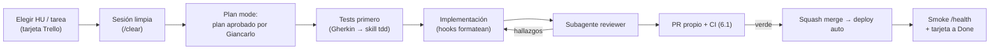

# Yacco — Plan de ejecución con Claude Code

**Rol de este documento:** plan operativo del arquitecto. Traduce la línea base (_Yacco — Documentación técnica v1.0_, Capítulos I–VII) en un método de trabajo concreto: cómo se ejecutan los sprints S0–S8 día a día con Claude Code como agente de implementación, y qué skills, hooks, subagentes y servidores MCP se configuran para que las convenciones y los invariantes del dominio se cumplan por herramienta, no por memoria.

**Versión:** 1.0 · Agosto de 2026 · Complementa (no reemplaza) los Capítulos IV–VI del documento base.

---

## 0. Principios de ejecución

| #   | Principio                                                        | Consecuencia práctica                                                                                                                                                                           |
| --- | ---------------------------------------------------------------- | ----------------------------------------------------------------------------------------------------------------------------------------------------------------------------------------------- |
| 1   | **La documentación manda.**                                      | El doc base vive en `docs/` del repositorio y es la fuente de verdad de Claude Code. Si el código y el doc discrepan, se detiene el trabajo y se resuelve primero en el doc.                    |
| 2   | **Convenciones por herramienta, no por memoria.**                | La regla de idioma (identificadores en inglés) y los invariantes del libro mayor se codifican en `CLAUDE.md`, skills y hooks. Claude Code no debe "recordarlas": debe tenerlas siempre delante. |
| 3   | **Incremento pequeño desplegado > módulo grande sin desplegar.** | Cada semana cierra con tag, deploy y demo, exactamente como fija el 4.2.                                                                                                                        |
| 4   | **TDD donde vive el riesgo.**                                    | Los criterios Gherkin del 2.4 se convierten en pruebas _antes_ de implementar (skill `tdd`). La UI no persigue cobertura.                                                                       |
| 5   | **"Advertir sin bloquear" también aplica al proceso.**           | Los guardas (hooks, subagente revisor) avisan; Giancarlo confirma. Ninguna automatización toma decisiones destructivas sola.                                                                    |
| 6   | **Roles claros.**                                                | Giancarlo: arquitecto, revisor y validador con el dueño. Claude Code: implementación, pruebas, refactor y trabajo mecánico. El dueño de la planta: validación semanal.                          |

---

## 1. Día 0 — Preparación del entorno (antes de S0)

Media jornada de trabajo manual que desbloquea todo lo demás.

### 1.1 Cuentas y accesos

| Servicio            | Acción                                                         | Nota                                                                  |
| ------------------- | -------------------------------------------------------------- | --------------------------------------------------------------------- |
| GitHub              | Crear repo **público** `yacco`; proteger `main` (CI requerida) | Habilita SonarCloud, CodeQL y Actions gratis (5.2)                    |
| Neon                | Proyecto `yacco` con **dos BD**: `yacco_prod` y `yacco_demo`   | Plan Free ya verificado en 4.1; la BD demo cabe holgada en los 0.5 GB |
| Render              | Cuenta + workspace; aún sin servicios                          | Los servicios se crean en S0-D6                                       |
| Cloudflare R2       | Bucket `yacco-evidence` + token S3 (scoped al bucket)          | Requiere tarjeta aunque no facture                                    |
| SonarCloud          | Organización vinculada al repo                                 | Se activa cuando exista el repo                                       |
| Sentry, UptimeRobot | Cuentas creadas; proyectos en S0-D6                            | Canal de alertas: correo (6.4)                                        |
| Expo                | Cuenta EAS para builds del móvil                               | Se usa desde S6                                                       |

### 1.2 Máquina local

- Node.js LTS + pnpm; Docker (para Compose y Testcontainers).
- Claude Code instalado con el instalador nativo (`curl -fsSL https://claude.ai/install.sh | bash`) y verificado con `claude --version` y `claude doctor`. Documentación oficial: https://code.claude.com/docs y https://docs.claude.com/en/docs/claude-code/overview.
- `gh` CLI autenticado (PRs e issues desde la terminal y desde Claude Code).
- Samsung Galaxy A17 con depuración USB habilitada (dispositivo de referencia de 5.3).

---

## 2. Configuración de Claude Code para Yacco

Esta configuración **es un entregable del sprint S0** (día 1): se versiona en el repo y evoluciona con el proyecto. La jerarquía, del contexto permanente a lo puntual:

| Pieza                | Archivo                          | Cuándo actúa                                                                       |
| -------------------- | -------------------------------- | ---------------------------------------------------------------------------------- |
| Memoria del proyecto | `CLAUDE.md` (raíz)               | Siempre cargada, en cada sesión                                                    |
| Skills               | `.claude/skills/<name>/SKILL.md` | Bajo demanda: Claude las carga cuando la tarea coincide, o se invocan como comando |
| Hooks                | `.claude/settings.json`          | Deterministas, en eventos del ciclo (después de editar, antes de un comando)       |
| Subagentes           | `.claude/agents/`                | Delegación con contexto aislado                                                    |
| MCP                  | `.mcp.json` (raíz, sin secretos) | Conexión a servicios externos                                                      |

**Extensión propuesta a la regla de idioma:** los artefactos que consume la herramienta —`CLAUDE.md`, `SKILL.md`, hooks, workflows de CI— se tratan como código y se escriben en **inglés**; el español sigue reservado a la interfaz y a la documentación humana (`docs/`). Es la extensión natural de la convención del Capítulo III y mejora la fiabilidad con la que el agente sigue instrucciones.

### 2.1 `CLAUDE.md`

Contenido mínimo (borrador completo en el **Anexo A**): resumen del proyecto y del monorepo, la regla de idioma como innegociable y retroactiva, comandos (`pnpm ...`), los **invariantes del dominio** (libro mayor inmutable, dos deudas independientes, FIFO, límite que advierte sin bloquear, `NUMERIC` para dinero, escritura del repartidor solo por `/sync/operations`), el flujo de trabajo (TDD desde Gherkin, Conventional Commits, expand/contract, ventana 8:00–20:00) y la lista de prohibiciones.

### 2.2 Skills del proyecto (`.claude/skills/`)

| Skill               | Se activa cuando…                                              | Contenido esencial                                                                                                                                                                                                |
| ------------------- | -------------------------------------------------------------- | ----------------------------------------------------------------------------------------------------------------------------------------------------------------------------------------------------------------- |
| `yacco-conventions` | Se escribe o revisa cualquier código, esquema o endpoint       | Regla de idioma con ejemplos buenos/malos por capa; **glosario dominio ES → identificador EN** (bidón→container, parque→fleet, canje→exchange, fiado→on credit, liquidación→settlement…). Borrador en **Anexo B** |
| `domain-invariants` | Se toca `containers`, `production`, `routes`, `sales` o `sync` | Tabla de efectos de cada `ContainerMovementType` sobre parque y saldo del cliente; inmutabilidad del libro; saldos materializados en la misma transacción; rutina de cuadre                                       |
| `prisma-migration`  | Cualquier cambio de esquema                                    | Disciplina expand/contract, checklist (`prisma validate`, migración al día, jamás editar una aplicada), ventana de despliegue con migración                                                                       |
| `nest-module`       | Se crea un módulo o endpoint nuevo                             | Anatomía estándar: module/controller/service/DTOs con `class-validator`/spec; guardas por rol; decoradores Swagger; rutas `kebab-case` plural                                                                     |
| `sync-protocol`     | S6–S7, todo lo relativo a offline                              | Sobre de operación con UUID de dispositivo, orden de aplicación, idempotencia, versionado tolerante del payload, manejo de `REJECTED`                                                                             |
| `sprint-close`      | Cierre de cada sprint (invocable: `/sprint-close`)             | Checklist: CI verde → tag semver → changelog desde Conventional Commits → deploy verificado + smoke → seed de demo → acta → issues `validation` → **actualizar Cap. IV–VI del doc con la evidencia real**         |
| `demo-seed`         | Antes de cada demo y del piloto                                | Datos realistas peruanos (S/, Yape/Plin, zonas), guion de demo por sprint, procedimiento de carga del padrón real (5.3.2)                                                                                         |

**Skills personales que ya existen y se reutilizan** copiándolas al repo (o manteniéndolas en el ámbito de usuario): `tdd` (ciclo rojo-verde-refactor sobre los Gherkin), `diagnose` (bugs y regresiones con método), `handoff` (traspaso entre sesiones cuando una tarea queda a medias), `grill-me` (entrevista de decisiones antes de piezas grandes, como el motor de sincronización).

### 2.3 Hooks (deterministas, mínimos)

Dos son suficientes al inicio (JSON en **Anexo C**):

1. **PostToolUse** sobre `Edit|Write`: Prettier + ESLint `--fix` sobre el archivo tocado. El formato deja de ocupar conversación.
2. **PreToolUse** sobre `Bash`: guarda que **advierte y pide confirmación** ante comandos peligrosos (`prisma migrate reset` fuera de local, `git push --force`, escritura de `.env`). Coherente con el principio 5: avisa, no bloquea a ciegas.

Husky + lint-staged siguen en pre-commit como red humana (4.1); la CI repite todo (6.1). Tres capas, cero discusiones de estilo.

### 2.4 Subagentes (solo dos)

| Subagente  | Modo         | Función                                                                                                                                             |
| ---------- | ------------ | --------------------------------------------------------------------------------------------------------------------------------------------------- |
| `reviewer` | Solo lectura | Antes de abrir el PR: revisa el diff contra `yacco-conventions`, `domain-invariants` y los criterios Gherkin de la HU; devuelve hallazgos, no edita |
| `explorer` | Solo lectura | Lecturas largas (documentación de librerías, archivos grandes) en contexto aislado; devuelve resúmenes para no contaminar la sesión principal       |

Un desarrollador solo no necesita un zoológico de agentes; estos dos cubren el 95 % del valor (revisión sistemática y contexto limpio).

### 2.5 Servidores MCP

| Servidor             | Estado                                              | Uso en Yacco                                                                                                                | Desde        | Alcance y seguridad                                                                                                    |
| -------------------- | --------------------------------------------------- | --------------------------------------------------------------------------------------------------------------------------- | ------------ | ---------------------------------------------------------------------------------------------------------------------- |
| **Figma** (Dev Mode) | Oficial                                             | Leer los wireframes de 3.2 e implementar la UI web/móvil fiel al diseño (ya se usa en claude.ai para diseñarlos)            | S1           | Solo lectura                                                                                                           |
| **Neon**             | Oficial (remoto `https://mcp.neon.tech/mcp`, OAuth) | Inspeccionar esquema, SQL de verificación, ramas de BD efímeras para experimentos                                           | S0           | **Solo desarrollo**: el propio Neon desaconseja usarlo contra producción; nunca apuntarlo a `yacco_prod` con escritura |
| **Render**           | Oficial (`render.com/docs/mcp-server`)              | Consultar servicios, historial de deploys y logs sin salir de la sesión                                                     | S0           | Lectura; los cambios de configuración se hacen en el dashboard (el propio servidor remite allí)                        |
| **Trello**           | Oficial (ya conectado en claude.ai)                 | Tablero de backlog: una lista por sprint, una tarjeta por HU con sus criterios; checklist de la tarjeta = criterios Gherkin | S0           | Escrituras confirmadas manualmente                                                                                     |
| **GitHub**           | Vía `gh` CLI (recomendado); MCP opcional            | PRs propios, issues `validation`, estado de checks                                                                          | S0           | El CLI autenticado basta en la práctica                                                                                |
| **Context7**         | Comunidad (Upstash)                                 | Documentación al día de NestJS, Prisma y Expo al implementar                                                                | Opcional     | Solo lectura                                                                                                           |
| **Playwright**       | Oficial (Microsoft)                                 | Depurar E2E de la web de forma interactiva                                                                                  | S5, opcional | Local                                                                                                                  |
| **Sentry**           | Oficial                                             | Triage de errores desde la sesión                                                                                           | Post-MVP     | Lectura                                                                                                                |

Reglas de seguridad MCP: mínimo privilegio por token; toda escritura vía MCP se revisa antes de confirmar; **ningún MCP con escritura contra la base de producción, nunca**. El `.mcp.json` del repo (Anexo C) versiona las definiciones sin secretos; credenciales por variables de entorno locales.

---

## 3. Ciclo de trabajo con Claude Code

### 3.1 El bucle por tarea



Reglas de sesión que evitan los fallos típicos del trabajo con agentes:

- **Una HU (o una tarea) por sesión.** `/clear` entre tareas; si algo queda a medias, skill `handoff` para retomar sin re-explicar.
- **Plan mode para todo lo no trivial.** El plan se aprueba antes de tocar código; es la revisión de diseño de un equipo de uno.
- **Prompts que citan la fuente.** "Implementa HU-12, escenario E2 (deuda de envases), criterios textuales del doc §2.4" rinde mucho más que "haz el módulo de entregas". Los Gherkin ya escritos son los mejores prompts del proyecto.
- **Piezas grandes pasan por `grill-me` primero.** Motor de sincronización, liquidación: entrevista de decisiones → mini-diseño → recién entonces implementación.
- **Diffs pequeños.** Si el PR no se puede revisar en 15 minutos, la tarea estaba mal cortada.

### 3.2 Cadencia semanal (sprint de 7 días, 4.2)

| Día | Foco                                                                                                                                                         |
| --- | ------------------------------------------------------------------------------------------------------------------------------------------------------------ |
| 1   | Planificación: bajar las HU del sprint a tarjetas/tareas; decisiones abiertas con `grill-me`; plan aprobado                                                  |
| 2–5 | Implementación en bucles del 3.1 (2–4 tareas/día realistas con dedicación diaria)                                                                            |
| 6   | Endurecimiento: integración completa, invariantes, E2E si aplica, deploy verificado, `demo-seed`                                                             |
| 7   | `/sprint-close`: tag + changelog + acta; **demo con el dueño** (él ejecuta, no observa); registrar issues `validation`; retro de 15 min y ajuste del backlog |

---

## 4. Plan por sprints

El alcance por sprint es el del 4.2 del doc base (no se renegocia aquí); lo que sigue añade la **capa de ejecución**: orden técnico, uso de Claude Code y criterio de cierre. La regla de recorte del doc se mantiene intacta: primero cae lo accesorio, jamás la integridad de saldos ni el ciclo operativo.

### S0a — Andamiaje y datos (tag `v0.1.0-alpha`)

Semana sin funcionalidad visible: se construye el terreno sobre el que corren las otras nueve.

| Día   | Entregable                                                                                                                                                                                                                           |
| ----- | ------------------------------------------------------------------------------------------------------------------------------------------------------------------------------------------------------------------------------------ |
| D1    | Monorepo pnpm (`apps/api`, `apps/web`, `apps/mobile` vacío, `packages/shared`); ESLint+Prettier+Husky compartidos; TypeScript `strict`; scripts `pnpm -r` sin orquestador                                                            |
| D2    | **Configuración de Claude Code completa** (`CLAUDE.md`, 7 skills, 2 hooks, `.mcp.json`, subagentes); doc base a `docs/`; `docker-compose.yml` (PostgreSQL + MinIO)                                                                   |
| D3–D4 | **Esquema Prisma completo del §3.5** con `@map`/`@@map`, migración inicial, restricciones `CHECK` e índices; seeds (`container_types`, `payment_methods`, `roles`, admin)                                                            |
| D5    | CI del §6.1 (lint, typecheck, unit, integración con Testcontainers, `prisma validate`, build, gitleaks, audit) + SonarCloud + CodeQL + Dependabot                                                                                    |
| D6    | Revisión manual del esquema contra el §3.5, restricción por restricción; primer PR grande con `reviewer`                                                                                                                             |
| D7    | **Entrevista de datos con el dueño** (no demo): padrón de clientes, escala real de la planta —el PENDIENTE del §2.2—, formato de sus cuadernos, saldos que cree tener en la calle. Cierra con el plan de carga del padrón para S2–S3 |

### S0b — Autenticación y despliegue (HU-22, HU-23 · `v0.1.0`)

| Día   | Entregable                                                                                                                                   |
| ----- | -------------------------------------------------------------------------------------------------------------------------------------------- |
| D1–D2 | `AuthModule` (acceso corto + refresco de 30 días, guardas por rol) y `UsersModule` con roles múltiples — HU-22/23 con pruebas                |
| D3    | Esqueleto web: Vite + router + login + layout con navegación por rol                                                                         |
| D4–D5 | Producción: Render (API Docker + static site), Neon `yacco_prod`, R2; `prisma migrate deploy` en el pipeline; `/health`; UptimeRobot; Sentry |
| D6    | Segunda instancia **demo** (BD Neon aparte, mismo código) con `demo-seed`; smoke E2E de login                                                |
| D7    | `/sprint-close`; **Demo 1**: el dueño inicia sesión y crea un usuario                                                                        |

**Por qué se partió:** S0 concentraba andamiaje, esquema, auth, web, CI y producción en siete días. Partirlo corre el MVP a la **semana 10** y evita el patrón clásico de arrastrar deuda desde el primer sprint. La numeración S1–S8 no cambia.

**Decisiones aplicadas:** esquema **completo** en S0a (el modelo ya está validado y sus tablas están entrelazadas; deja los sprints siguientes como sprints de _lógica_); Prisma con modelos `PascalCase` y campos `camelCase` mapeados a `snake_case` vía `@map`/`@@map` (el §3.5 se respeta en la BD y el cliente TypeScript queda idiomático); **pnpm sin Turborepo/Nx** (tres paquetes no justifican la capa; se añade si el CI supera los ~10 min).

**Con Claude Code:** D1, D2 y D5 son su terreno ideal (andamiaje y YAML de CI, con `explorer` leyendo docs de Actions/Sonar); el esquema se genera desde el Mermaid ER del doc y **se revisa a mano** — es la pieza más cara de equivocar.

### S1 — Catálogo y clientes (HU-05, HU-08 · `v0.2.0`)

- **Tareas:** `CatalogModule` (productos sembrados, precios de lista), `CustomersModule` + zonas, `CustomerPrice` con precedencia sobre lista (solo ADMIN); web: listado/alta/ficha básica de cliente, gestión de precios personalizados.
- **Claude Code:** primer uso real de `nest-module` y `yacco-conventions`; **wireframes de estas pantallas en Figma esta semana** (chat de claude.ai + conector Figma) y luego implementación leyendo el diseño vía Figma MCP.
- **Pruebas de cierre:** resolución de precio (personalizado > lista) unitaria; CRUD por integración.
- **Demo:** el dueño registra un cliente real y le asigna su precio acordado.

### S2 — Producción y parque (HU-01, HU-02, HU-04 · `v0.3.0`)

- **Tareas:** `ProductionModule` (lote + responsable, consumo de vacíos) y `ContainersModule` con el **libro `container_movements`** y la vista de inventario por estado y tipo; ingreso de envases nuevos; advertencia (no bloqueo) cuando el llenado supera los vacíos (E2 de HU-01).
- **Claude Code:** `domain-invariants` obligatoria; TDD sobre los efectos de `FLEET_ENTRY` y `FILLING`; el `reviewer` verifica que ningún código actualice o borre movimientos.
- **Pruebas de cierre:** la suma por estados cuadra con el parque total (E1 de HU-02) — primera versión de la prueba de invariantes.
- **Demo:** el dueño registra el lote de ese día. **Arranca la carga del padrón** (5.3.2): clientes reales desde los cuadernos.

### S3 — Saldos y bajas (HU-03, HU-20 · `v0.4.0`)

- **Tareas:** `customer_container_balances` materializado en la misma transacción; bajas por daño (planta) y pérdida (cliente, descuenta saldo); reporte de envases prestados por cliente y tipo.
- **Claude Code:** la **rutina de cuadre** (reconstrucción desde el libro vs. materializado) se escribe como prueba y entra a la CI y al cron diario (6.4); `demo-seed` incorpora el procedimiento de saldos iniciales del padrón (apertura como movimientos `LOAN_DELIVERY` documentados).
- **Pruebas de cierre:** invariantes en verde con datos del padrón cargados.
- **Demo:** el reporte de prestados frente a lo que el dueño _cree_ tener en la calle; cada discrepancia se documenta (es validación del modelo, no un bug).

### S4 — Pedidos y crédito (HU-06, HU-07, HU-09 · `v0.5.0`)

- **Tareas:** `OrdersModule` (preventa, estados, precio congelado al capturar); base de `SalesModule` para el estado de cuenta; ficha completa del cliente (deuda, saldo de envases, historial); límite de crédito que **advierte, registra `credit_limit_exceeded` y permite continuar**.
- **Pruebas de cierre:** Gherkin de HU-09 textual; estado de cuenta = cargos − abonos.
- **Demo:** el vendedor (o el dueño) captura pedidos reales del día siguiente; la advertencia de límite se muestra con un cliente real.

### S5 — Rutas y FIFO (HU-10 · `v0.6.0`)

- **Tareas:** `RoutesModule.plan` y `loadFifo` (consumo del lote más antiguo con existencias, multi-lote); pedidos asignados pasan a `ON_ROUTE`; web de planificación (paradas + carga sugerida).
- **Regla de reserva (decidida):** `available_qty` se descuenta **al planificar** con un movimiento `ROUTE_LOAD`; el stock de planta refleja la realidad desde ese instante y dos rutas no pueden reservar el mismo lote. Cancelar o replanificar una ruta emite el movimiento inverso. La diferencia entre lo reservado y lo realmente cargado en el camión la resuelve la liquidación (S8).
- **Claude Code:** TDD intensivo del FIFO (lote único, cruce de lotes, empates por fecha, stock insuficiente → advertencia); primer E2E Playwright: planificar y cargar una ruta.
- **Descarga de riesgo (recomendación de arquitecto):** en paralelo, crear `packages/sync-engine` — la cola offline como **TypeScript puro sin dependencias de dispositivo** (encolar, reintentar, marcar aplicada/duplicada) con su suite unitaria, tal como prevé el 5.1. Le quita a S6–S7 la mitad del riesgo antes de abrir Expo.
- **Demo:** el dueño planifica la ruta real de mañana y ve la carga FIFO calculada.

### S6 — Móvil: ruta offline (HU-11, HU-12 · `v0.7.0`)

- **Tareas:** app Expo: login, descarga de la ruta del día a SQLite, pantalla de parada con registro de llenos/vacíos por tipo y las **dos resoluciones del canje** (deuda de envases / venta completa) escribiendo a la cola local.
- **Claude Code:** skill `sync-protocol` activa; UI contra wireframes de Figma; los tres escenarios de HU-12 primero como pruebas del `sync-engine`, luego como flujo en la app.
- **Validación:** toda verificación manual **en el Galaxy A17**, con modo avión; guion de prueba manual del sprint.
- **Demo/piloto:** primera ruta con **doble registro** (app + cuaderno) acompañando al repartidor.

### S7 — Móvil: cobros, autoventa, sincronización y evidencia (HU-13, HU-14, HU-16, **HU-15** · `v0.8.0`)

- **Tareas:** cobro por parada (total/parcial/fiado) con **medio de pago obligatorio**; autoventa con cliente creado en campo (UUID de dispositivo); `POST /api/v1/sync/operations` idempotente y en orden; estado de sincronización visible en la app; alerta por operaciones `REJECTED` (6.4); **`EvidenceModule` + cola de fotos** (URL prefirmada a R2, subida diferida).
- **HU-15 adelantada desde Post-MVP:** el piloto se juega en las disputas ("yo dejé tres bidones"), y la foto es justamente la prueba. Llegar al piloto sin ella deja sin verificar el argumento comercial más fuerte del sistema. Contrapeso: si S7 se tensa, la evidencia cae _antes_ que la idempotencia — la regla de recorte del §4.2 sigue intacta.
- **Autoventa por encima de la carga:** se permite registrar más de lo que dice la carga, con advertencia visible; el faltante lo revela la liquidación. Bloquear haría que el repartidor vuelva al cuaderno, que es el fracaso que el proyecto intenta evitar.
- **Claude Code:** la prueba de integración reina del proyecto: la misma operación enviada dos veces se aplica **exactamente una** (HU-16 E1); `diagnose` a mano para lo que aparezca en campo.
- **Piloto:** rutas 2 y 3 con doble registro, incluyendo tramos sin señal forzados.
- **Demo:** el dueño ve llegar al panel, sincronizadas, las operaciones registradas sin señal en la calle.

### S8 — Cierre del ciclo (HU-17, HU-18 · `v0.9.0` → **MVP**)

- **Tareas:** `RouteSettlement` con la conciliación aritmética completa (llenos salidos = entregados + vendidos + retornados; vacíos recogidos = descargados; vendido = cobrado + fiado; toda diferencia registrada); pagos desde la web; reporte de cobranza por medio de pago.
- **Regla de cierre (decidida):** si la liquidación **no cuadra**, el sistema registra la diferencia con motivo y **cierra igual**; nunca bloquea. Una ruta sin liquidar es peor que una liquidada con faltante documentado: la diferencia registrada es el dato que el dueño necesita para gestionar mermas y conversar con el repartidor. Las rutas con diferencia distinta de cero salen listadas en el panel y en el correo del cuadre diario.
- **Corrección de errores del campo:** una parada mal registrada que ya sincronizó **no se edita**: el ADMIN emite desde la web un movimiento inverso (y/o nota de crédito) con motivo y autor. El libro mayor sigue siendo inmutable y la corrección queda auditada — lo contrario reabre la puerta a "arreglar" el histórico, que es exactamente el problema del cuaderno.
- **Validación de salida del piloto (5.3.3):** liquidar al menos una ruta real que **cuadre contra el cuaderno sin ajustes**; 100 % de operaciones offline aplicadas exactamente una vez; saldos y deudas coinciden con cuaderno y dueño; el repartidor juzga la app igual o más rápida que el cuaderno.
- **Cierre:** con el piloto aprobado se abandona el doble registro, la app pasa a ser el registro oficial y se etiqueta **`v1.0.0`**.

### Post-MVP (HU-19, HU-21)

Reporte de deuda con antigüedad, reporte de producción; después, los PENDIENTE de identidad de marca y el roadmap del 7.2 (venta directa de envases, orden asistido de paradas, SUNAT vía OSE, salida de la capa gratuita, playbook de réplica por planta).

---

## 5. Definition of Done

**Por Pull Request:**

1. CI del 6.1 en verde completa (lint, typecheck, unitarias, integración, invariantes, `prisma validate`, build, gitleaks, audit).
2. Identificadores 100 % en inglés (hallazgo del `reviewer` = bloqueo propio).
3. Los criterios Gherkin tocados tienen prueba que los cita.
4. Migraciones, si las hay: expand/contract y merge fuera de la ventana 8:00–20:00 (America/Lima).
5. Conventional Commit en el squash; sin TODO sin issue asociado.

**Por sprint:** HU verificadas **en producción**; cobertura ≥ 80 % en módulos de dominio (quality gate SonarCloud); tag + changelog; demo ejecutada por el dueño con acta; issues `validation` registradas y priorizadas; **Capítulos IV–VI del doc actualizados con la evidencia real** (commits, tag, URL, acta) — el doc es línea base viva.

---

## 6. Riesgos de ejecución y mitigaciones

| Riesgo                                                   | Señal temprana                                                 | Mitigación                                                                                                                                  |
| -------------------------------------------------------- | -------------------------------------------------------------- | ------------------------------------------------------------------------------------------------------------------------------------------- |
| Sincronización offline se desvía (el riesgo #1 del plan) | `sync-engine` sin suite verde al cerrar S5                     | Descarga de riesgo en S5; `grill-me` antes de diseñarlo; regla de recorte del 4.2 (caen HU-15 y reportes, nunca integridad ni liquidación)  |
| Código generado que deriva de las convenciones           | Identificadores en español, floats en dinero, updates al libro | Triple capa: `CLAUDE.md` + skills siempre presentes, subagente `reviewer` por PR, SonarCloud/CI como red final                              |
| Contexto degradado en sesiones largas                    | Claude Code "olvida" reglas o repite trabajo                   | Una tarea por sesión, `/clear` disciplinado, `handoff` para continuar, `explorer` para lecturas pesadas                                     |
| Cold start de Render Free en plena demo (~30–60 s)       | Primera petición lenta tras 15 min                             | UptimeRobot mantiene el servicio despierto; calentar `/health` 10 min antes de cada demo; Starter (US$ 7) cuando la planta dependa a diario |
| Deriva de capas gratuitas (lección del 7.1)              | Cambios de pricing anunciados                                  | Revisión mensual de consumo Neon/R2 (6.4); decisiones de proveedor se reverifican en la fecha, no se asumen                                 |
| Scope creep desde las demos                              | Pedidos del dueño en medio del sprint                          | Todo entra como issue `validation`, se prioriza el día 1 del sprint siguiente; nunca se interrumpe el sprint en curso                       |
| Secreto filtrado en repo público                         | Alerta de gitleaks / secret scanning                           | `.env` en `.gitignore` desde el primer commit; hooks del 2.3; rotación inmediata si ocurre                                                  |
| Bus factor = 1                                           | —                                                              | El propio método: doc vivo, Conventional Commits, tags por sprint, `handoff`, backups nocturnos de 6.4 con restauración probada             |

---

## 7. Checklist de arranque (esta semana)

1. Día 0 completo (§1): cuentas, repo público, Claude Code instalado y `claude doctor` limpio.
2. S0a-D1/D2: monorepo + tooling + **configuración de Claude Code** (Anexos A–C como punto de partida, ya con los invariantes del §8) + doc en `docs/`.
3. Tablero Trello: listas S0a, S0b, S1…S8 + Post-MVP; una tarjeta por HU con sus criterios Gherkin como checklist (se puede generar desde este chat con el conector ya conectado).
4. **Agendar la entrevista de datos con el dueño para S0a-D7** — es la que cierra el PENDIENTE de escala del §2.2 y define la carga del padrón.
5. Wireframes en Figma de las pantallas de S1 (clientes, precios) — media jornada, en paralelo.
6. Trasladar al documento base las cinco enmiendas ✏️ del §8 en el primer `/sprint-close`.

---

## 8. Registro de decisiones (sesión de grill, agosto 2026)

Las 20 decisiones tomadas en la entrevista de diseño. Las marcadas con ✏️ **enmiendan** el documento base y deben trasladarse a él en el próximo `/sprint-close`.

| #    | Decisión                                                                 | Motivo                                                                                                                                  |
| ---- | ------------------------------------------------------------------------ | --------------------------------------------------------------------------------------------------------------------------------------- |
| D-01 | Artefactos de herramienta (`CLAUDE.md`, skills, hooks, CI) en **inglés** | ✏️ Extiende la regla del §III: son código, no documentación humana                                                                      |
| D-02 | Esquema Prisma **completo** en S0a                                       | Tablas entrelazadas; deja S1–S8 como sprints de lógica                                                                                  |
| D-03 | Prisma con `@map`/`@@map`: modelos `PascalCase`, BD `snake_case`         | Respeta el §3.5 sin renunciar a un cliente TS idiomático                                                                                |
| D-04 | **pnpm sin orquestador**; Turbo/Nx solo si el CI supera ~10 min          | Tres paquetes no justifican la capa                                                                                                     |
| D-05 | `packages/sync-engine` en **S5**, TypeScript puro                        | Descarga el riesgo #1 antes de abrir Expo                                                                                               |
| D-06 | Sobres de sincronización **genéricos y versionados**                     | Compatible con migraciones expand/contract y apps que sincronizan tarde                                                                 |
| D-07 | Lote de sincronización **atómico** (una transacción)                     | Una parada es entrega + venta + cobro: partirla deja saldos a medias                                                                    |
| D-08 | Operación venenosa → **cuarentena + correo**, el resto avanza            | Sin esto, un solo bug congela la jornada completa                                                                                       |
| D-09 | FIFO: **reserva lógica al planificar** (`ROUTE_LOAD`)                    | Evita doble reserva del mismo lote; el stock refleja la realidad                                                                        |
| D-10 | Autoventa **por encima de la carga: permitida con advertencia**          | Bloquear devuelve al repartidor al cuaderno                                                                                             |
| D-11 | Liquidación descuadrada **se registra y cierra**                         | La diferencia documentada es el dato de valor, no un obstáculo                                                                          |
| D-12 | Saldos iniciales del padrón como **movimientos de apertura fechados**    | El libro mayor sigue siendo la única fuente; el cuadre no falla desde el día uno                                                        |
| D-13 | **Instancia demo** con BD Neon aparte desde S0b                          | ✏️ Matiza el "sin staging" del §4.1: no es una puerta de pre-producción, es un sandbox para demos, entrenamiento y el ensayo del piloto |
| D-14 | JWT: acceso corto + **refresco de 30 días** en el móvil                  | El repartidor puede pasar días sin cobertura útil                                                                                       |
| D-15 | **`timestamptz` UTC + fechas de negocio en America/Lima**                | ✏️ Regla explícita ausente del §3.5; evita rutas "del día" corridas                                                                     |
| D-16 | **HU-15 (evidencia) adelantada a S7**                                    | ✏️ El piloto se juega en disputas; la foto es la prueba                                                                                 |
| D-17 | Correcciones del campo: **movimiento inverso desde la web (ADMIN)**      | Preserva la inmutabilidad del libro y la auditoría                                                                                      |
| D-18 | **S0 se parte en S0a + S0b**; MVP a la **semana 10**                     | ✏️ Reemplaza el S0 de 7 días del §4.2; evita arrastrar deuda desde el inicio                                                            |
| D-19 | S0a cierra con **entrevista de datos**, no demo                          | Aprovecha la semana sin funcionalidad y cierra el PENDIENTE de escala del §2.2                                                          |
| D-20 | Piloto: **OTA por defecto**, APK nuevo solo si cambia lo nativo          | Correcciones diarias sin reinstalar en el A17                                                                                           |

### Cuestiones que siguen abiertas

- **Escala de la planta** (clientes activos, pedidos/día, repartidores): PENDIENTE del §2.2, se cierra en la entrevista de S0a-D7 y puede mover prioridades.
- **Identidad de marca y wireframes** (§3.1, §3.2): los de S1 se dibujan esa misma semana; el resto, sprint a sprint.
- **Política de retención de fotos en R2**: 10 GB gratuitos alcanzan un buen tiempo, pero conviene fijar retención (¿12 meses?) antes de que el volumen decida por sí solo.
- **Qué pasa si el piloto falla**: el §5.3 define los criterios de éxito pero no el plan B. Vale acordarlo con el dueño antes de S6.

---

## Anexo A — `CLAUDE.md` propuesto

```markdown
# CLAUDE.md — Yacco

## Project

Management system for a water purification plant in Peru (currency: soles, S/).
pnpm monorepo: `apps/api` (NestJS modular monolith + Prisma/PostgreSQL),
`apps/web` (React + Vite), `apps/mobile` (Expo, offline-first),
`packages/shared` (DTO contracts), `packages/sync-engine` (pure-TS offline queue).
The spec at `docs/yacco-documentacion.md` is the source of truth. If code and
spec disagree, STOP and ask before proceeding.

## Language rule (non-negotiable, retroactive)

- ALL code identifiers in English: classes `PascalCase`, variables/functions
  `camelCase`, DB tables/columns `snake_case` (plural tables), enum values
  `SCREAMING_SNAKE_CASE`, REST routes `kebab-case` plural under `/api/v1`.
- Spanish ONLY for UI strings and human docs. If you find a Spanish
  identifier anywhere, rename it.

## Commands

- `pnpm dev:api` / `pnpm dev:web` — local dev (Docker Compose must be up)
- `pnpm test` / `pnpm test:integration` — Jest/Vitest; integration uses Testcontainers
- `pnpm lint` / `pnpm typecheck` / `pnpm build`
- `pnpm prisma:validate` / `pnpm prisma:migrate` / `pnpm db:seed`
- NEVER run `prisma migrate reset` outside local Docker.

## Domain invariants (never violate)

- `container_movements` is an immutable ledger: no UPDATE/DELETE ever;
  corrections are inverse movements.
- Materialized balances (`customer_container_balances`, `customers.debt_balance`)
  update in the SAME transaction as their source movement/sale/payment and must
  always be reconstructible from the ledgers.
- Two independent debts per customer: containers (units) and money (S/).
  Never merge or convert between them.
- Route loading consumes batches strictly FIFO (oldest batch date first).
- Credit limit WARNS and records `credit_limit_exceeded`; it never blocks.
- Money is `NUMERIC(10,2)` end to end. Never floats.
- Every operational row records `created_at` and `recorded_by`/`created_by`.
- Driver field writes enter ONLY through `POST /api/v1/sync/operations`
  (idempotent by device-generated UUID; duplicates -> DUPLICATE, never re-applied).
- Sync batches are ALL-OR-NOTHING: one transaction per batch. An operation that
  fails validation twice goes to quarantine (status REJECTED + email alert) and
  the rest of the batch proceeds. Never partially apply a batch silently.
- Sync envelopes are versioned (`type`, `version`, `payload`); the server accepts
  older versions and normalizes. Never break an envelope shape in place.
- Route planning reserves stock: `ROUTE_LOAD` movement at plan time. Cancelling a
  route emits the inverse movement.
- A settlement with a mismatch still closes, recording the difference and reason.
  Never block a settlement.
- Field mistakes are corrected by ADMIN-issued inverse movements from the web,
  never by editing or deleting synced records.
- All timestamps are `timestamptz` in UTC. Business days (`routes.date`,
  `orders.delivery_date`) are calendar `date` in America/Lima; convert at the
  edges, never store local time in a timestamp.

## Workflow

- Domain logic is TDD: acceptance criteria in spec §2.4 (Gherkin) become tests first.
- Small diffs. Conventional Commits. PR + green CI before merge; squash to `main`.
- Migrations are expand/contract; merges containing migrations happen outside
  08:00–20:00 America/Lima.
- Don't add dependencies without asking. Don't read or write `.env*` files.
- Don't force-push. Don't edit applied migrations.
```

## Anexo B — Skill de ejemplo: `.claude/skills/yacco-conventions/SKILL.md`

```markdown
---
name: yacco-conventions
description: Naming and language conventions for all Yacco code. Use whenever
  writing or reviewing any code, Prisma schema, SQL, DTO, enum, or REST route,
  and when translating Spanish domain terms into English identifiers.
---

# Yacco naming conventions

## The rule

Identifiers in English; Spanish only in UI strings and human docs. Retroactive:
rename on sight.

| Layer          | Convention        | Good                  | Bad                 |
| -------------- | ----------------- | --------------------- | ------------------- |
| Classes/types  | PascalCase        | `RouteSettlement`     | `LiquidacionRuta`   |
| Vars/functions | camelCase         | `loadFifo()`          | `cargarFifo()`      |
| DB tables      | snake_case plural | `container_movements` | `MovimientosEnvase` |
| Enum values    | SCREAMING_SNAKE   | `FULL_SALE`           | `VentaCompleta`     |
| REST routes    | kebab-case plural | `/production-batches` | `/lotesProduccion`  |

## Domain glossary (ES business term -> EN identifier)

bidón/envase -> container · parque -> fleet · caño -> spigot ·
lote -> production batch · llenado -> filling · carga -> route load ·
parada -> route stop · canje -> exchange · préstamo -> loan ·
saldo de envases -> container balance · baja -> write-off ·
fiado -> on credit · deuda monetaria -> debt balance · abono -> payment ·
medio de pago -> payment method · liquidación -> settlement ·
preventa -> pre-sale (origin: ORDER) · autoventa -> van sale (VAN_SALE) ·
recarga -> refill (REFILL) · venta completa -> full sale (FULL_SALE) ·
evidencia -> evidence · zona -> zone · repartidor -> driver ·
vendedor -> seller · cuadre -> reconciliation

UI labels stay in Spanish (es-PE): "S/ 1,250.50", dates dd/mm/aaaa.
```

## Anexo C — Hooks y MCP (esqueletos)

`.claude/settings.json` (hooks):

```json
{
  "hooks": {
    "PostToolUse": [
      {
        "matcher": "Edit|Write",
        "hooks": [
          {
            "type": "command",
            "command": "pnpm exec prettier --write \"$CLAUDE_FILE_PATHS\" && pnpm exec eslint --fix \"$CLAUDE_FILE_PATHS\""
          }
        ]
      }
    ],
    "PreToolUse": [
      {
        "matcher": "Bash",
        "hooks": [{ "type": "command", "command": ".claude/hooks/guard-dangerous.sh" }]
      }
    ]
  }
}
```

`guard-dangerous.sh` advierte (y exige confirmación) ante: `migrate reset` fuera de local, `push --force`, `rm -rf` fuera del árbol del repo, escritura de `.env*`.

`.mcp.json` (sin secretos; completar según la guía oficial vigente de cada proveedor):

```json
{
  "mcpServers": {
    "neon": { "type": "http", "url": "https://mcp.neon.tech/mcp" },
    "render": { "//": "seguir render.com/docs/mcp-server (API key por env var)" },
    "figma": { "//": "seguir la guía oficial del Dev Mode MCP server de Figma" }
  }
}
```

---

_Fin del plan. Este documento se versiona en `docs/` junto a la línea base y se actualiza en cada `/sprint-close`._
